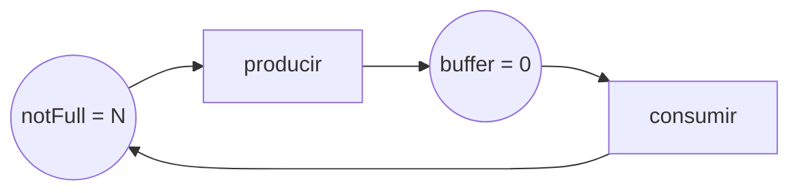
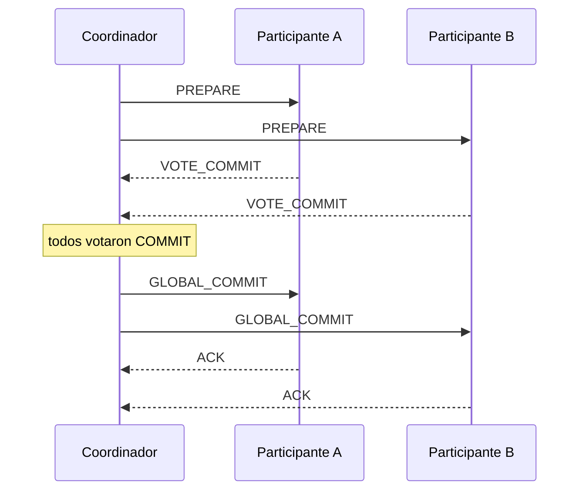

# Repaso final

[Abrir apunte](index.html)


**El mínimo indispensable para aprobar un final. Sin chamuyo.** Definiciones concisas, comparaciones y esquemas de lo que *siempre* cae. Cuando algo no te cierre, abrí el apunte completo (o tocá cualquier tema en el índice).

[← Volver al apunte completo](index.html)

Cómo es el final (patrón real de la cátedra).

5 ejercicios, casi todo

teoría + un diseño

. No hay que codear parciales: hay que

explicar, comparar y justificar

. Los temas rotan pero el molde es fijo:

1. **Redes de Petri:** definir ordinaria vs general, marca, disparo, grafo de alcance, y *modelar* un sistema.
2. **Sincronización teórica:** sección crítica y corrección; monitores vs semáforos; busy-wait/deadlock/race/starvation; o actores (motivación, características, ciclo de vida).
3. **Transacciones / Redes:** 2PC, concurrencia optimista, 2PL, timestamps; o modelo OSI, sockets, TCP vs UDP.
4. **Ambientes distribuidos:** entidad y capacidades, acción/regla/comportamiento, conocimiento, costo y complejidad, elección de líder.
5. **Diseño de un sistema:** proponer transaccionalidad, diagrama de entidades y mensajes, casos de éxito/falla y pseudocódigo Rust (actores).

Estrategia:

respondé con la

definición exacta

primero, después el ejemplo/diagrama, y cerrá con el trade-off. Los puntos se ganan en las palabras precisas, no en la extensión.

## 1 · Corrección: safety, liveness y los cuatro fantasmas

**Concurrencia** = varias tareas *progresan* en simultáneo (intercaladas); **paralelismo** = varias se *ejecutan* a la vez (varios cores). La salida de un programa concurrente **correcto** es siempre la misma; lo que varía es el *interleaving*, no el resultado.

- **Programa modelo:** cada proceso es un ciclo infinito dividido en **sección crítica** (accede a recursos compartidos) y sección no-crítica.
- **Safety** («algo malo *nunca* pasa», siempre verdadera): exclusión mutua y ausencia de deadlock.
- **Liveness** («algo bueno *eventualmente* pasa»): ausencia de starvation y fairness.

**Corrección de la sección crítica** (3 especificaciones):

- **Exclusión mutua:** las instrucciones de la SC no se intercalan.
- **Ausencia de deadlock:** si dos intentan entrar, eventualmente uno entra.
- **Ausencia de starvation:** si uno intenta entrar, eventualmente lo logra.

**Por qué importa la corrección:** el programa concurrente no es determinístico (la salida depende del escenario), así que no alcanza con debuggear como en secuencial; hay que *demostrar* propiedades.

| Fantasma | Qué es | Clave para distinguirlo |
| --- | --- | --- |
| **Busy-wait** (espera activa) | Gira en un loop *chequeando una condición* y quema CPU sin trabajo útil. | ¿Consume CPU inútilmente? El `sleep` **no** lo salva: poll-ear la condición sigue siendo espera activa. Se arregla bloqueándose (semáforo/condvar). |
| **Race condition** | El resultado depende del *timing* de accesos no sincronizados a estado compartido. | ¿El resultado depende del orden? Puede dar bien por casualidad y mal en otra corrida. Se arregla serializando (lock/actor). |
| **Deadlock** | Dos o más procesos esperan por un recurso que el otro tiene → dependencia cíclica; *nadie* avanza. | ¿Todos trabados esperándose? Falla global. Requiere intervención externa. |
| **Starvation** | Un proceso listo *nunca* obtiene el recurso porque otros lo acaparan. | ¿Uno postergado para siempre mientras el resto avanza? El sistema *sí* progresa (falla individual). |

**Deadlock — 4 condiciones de Coffman** (deben darse las cuatro juntas; basta romper una para prevenirlo): **exclusión mutua**, **hold &amp; wait** (retener y esperar), **no preemption** (no expropiación) y **espera circular**. Estrategias: *prevención* (negar una condición), *evitación* (banquero), *detección + recuperación* (grafo de recursos + abortar), *avestruz* (ignorarlo).

## 2 · Rust para concurrencia, en diez líneas

- **Ownership:** cada valor tiene un dueño; al salir de scope se libera (`drop`).
- **Borrowing:** o *una* referencia mutable, o *N* compartidas inmutables — nunca las dos. Esto elimina data races *en tiempo de compilación* («fearless concurrency»).
- **Send:** el tipo se puede *mover* a otro thread. **Sync:** se puede *compartir por referencia* (`&amp;T` es Send).

| Tipo | Para qué |
| --- | --- |
| `Box&lt;T&gt;` | Un dueño, dato en el heap (recursión, trait objects). |
| `Rc&lt;T&gt;` | Varios dueños, **un solo thread** (conteo no atómico). |
| `Arc&lt;T&gt;` | Varios dueños **entre threads** (conteo atómico). Solo lectura. |
| `Arc&lt;Mutex&lt;T&gt;&gt;` | Compartir *y mutar* entre threads con exclusión mutua. |
| `Arc&lt;RwLock&lt;T&gt;&gt;` | Muchos lectores *o* un escritor. |

## 3 · Modelos de concurrencia: cuándo uso cada uno

| Modelo | Idea | Cuándo |
| --- | --- | --- |
| **Fork-join** | Dividir recursivamente en subtareas independientes, resolver en paralelo y combinar. | Cómputo CPU-bound divisible (map/reduce, ordenar, sumar). |
| **Async / futures** | Tareas que ceden el thread mientras esperan; un executor las multiplexa. | I/O-bound: muchas conexiones/requests concurrentes. |
| **Threads + locks** | Memoria compartida protegida con mutex/rwlock. | Estado compartido acotado, control fino. |
| **Mensajes / canales** | Comunicar copiando datos por un canal (mpsc), sin memoria compartida. | Pipelines productor-consumidor; «no comuniques compartiendo, compartí comunicando». |
| **Actores** | Objetos con estado privado que solo se comunican por mensajes; procesan uno a la vez. | Estado mutable distribuido sin locks; simulaciones, sistemas reactivos. |
| **SIMD / GPU** | Una instrucción sobre muchos datos (data-parallel). | Throughput masivo homogéneo (imágenes, álgebra, ML). |

### Fork-join y work-stealing (cae textual)

- **Ventajas:** sin condiciones de carrera, determinístico, no comparte memoria (threads aislados). **Requiere** tareas independientes.
- **Rendimiento ideal:** tiempo secuencial / nº de threads (menos overhead de división y combinación).
- **Work-stealing:** cada thread tiene una *deque*; saca y encola tareas por su propio extremo; si se queda sin trabajo, **roba del otro extremo** de la cola de otro thread (elegido al azar).
- **Por qué NO una sola cola:** sería estado mutable compartido → exige exclusión mutua; un thread que genera muchas subtareas retiene el lock mientras encola y frena a los demás → latencia y cuello de botella.

### Actores (motivación + ciclo de vida en Actix)

- **Motivación:** encapsular estado mutable *sin locks*: como cada actor procesa un mensaje por vez, su estado nunca sufre data races.
- **Características:** dirección (`Addr`), *mailbox*, procesa mensajes de a uno, no comparte estado, se comunica solo por mensajes.
- **Ciclo de vida:** `Started → Running → Stopping → Stopped` (desde Stopping puede volver a Running).
- **Envío:** `do_send` (fire-and-forget, no espera respuesta) vs `send` (devuelve un future con la respuesta). **SyncArbiter** = pool de actores del mismo tipo para trabajo bloqueante.

**Async:** un `Future` es una máquina de estados que se avanza con `poll` (devuelve `Pending` o `Ready`); el *executor* reanuda la tarea cuando el recurso está listo, sin bloquear el thread. No «comprime el stack»: la memoria de la tarea sigue viva.

## 4 · Sincronización: mecanismos

| Mecanismo | Qué garantiza |
| --- | --- |
| **Mutex** | Un solo thread en la SC a la vez. |
| **RwLock** | N lectores *o* 1 escritor. |
| **Semáforo** | Contador de permisos: `wait/P` (decrementa o bloquea), `signal/V` (incrementa o despierta). Binario = mutex; contador = N recursos. |
| **Barrera** | Todos los threads esperan hasta que *todos* llegan al punto. |
| **Condvar** | Bloquearse hasta que se cumpla una condición; siempre dentro de un `while` (por *spurious wakeups*). |
| **Monitor** | Exclusión mutua + variables de condición, todo encapsulado en un objeto. |

### Monitor vs Semáforo (comparación de final)

| Aspecto | Semáforo | Monitor |
| --- | --- | --- |
| ¿`wait` bloquea? | No siempre (si V &gt; 0 no bloquea) | `waitC` **siempre** bloquea |
| ¿`signal` tiene efecto? | Siempre (incrementa o despierta) | `signalC` **no** hace nada si la cola está vacía |
| Estructura | Bajo nivel, disperso; fácil de usar mal | Alto nivel, encapsula estado + condiciones |
| Tras la señal | El desbloqueado sigue enseguida | El desbloqueado espera a que el señalizador deje el monitor |

Implementar un monitor:

mutex para la exclusión mutua + variables de condición (

waitC

libera el lock y bloquea;

signalC

despierta al primero de la cola). En Java:

synchronized

+

wait()

/

notify()

/

notifyAll()

(hay que tener el monitor adquirido para llamarlos).

## 5 · Problemas clásicos (esencia en una línea)

| Problema | Qué ilustra | Solución típica |
| --- | --- | --- |
| **Productor-consumidor** (buffer acotado) | Coordinar producción/consumo sin desbordar ni vaciar de más. | Semáforos `notFull` (=N) y `notEmpty` (=0) + mutex del buffer. |
| **Lectores-escritores** | Concurrencia de lecturas vs exclusividad de escritura + fairness. | RwLock; versión *fair* con cola para que el escritor no muera de hambre. |
| **Filósofos comensales** | Deadlock por espera circular; starvation por injusticia. | Ordenar recursos, o Chandy-Misra (prioridad acíclica con palitos limpios/sucios). |
| **Barbero dormilón** | Sincronizar un servidor que duerme cuando no hay trabajo. | Semáforos de clientes/barbero + mutex de la sala de espera. |
| **Fumadores** | Límite de los semáforos «pelados»; hace falta un intermediario. | Agente + *pushers* que combinan los ingredientes. |

## 6 · Redes de Petri

Herramienta **gráfica y matemática** para modelar sistemas concurrentes; es un **grafo dirigido bipartito** con dos tipos de nodos.

- **Lugares** (círculos) = estados/condiciones; contienen **tokens**. **Transiciones** (barras) = eventos. **Arcos** conectan lugar↔transición (nunca dos del mismo tipo).
- **Red ordinaria** `PN = (T, P, A)`: transiciones, lugares y arcos.
- **Red general** `PN = (T, P, A, W, M0)`: agrega **pesos** `W` (tokens por arco) y **marca inicial** `M0`.
- **Funciones de entrada/salida:** `I(t)` = lugares de entrada de `t` (los que consume); `O(t)` = lugares de salida (los que produce).
- **Marca** `M`: tokens por lugar = estado actual del sistema.
- **Regla de disparo:** `t` está *habilitada* si cada lugar de entrada `p` cumple `M(p) ≥ W(p,t)`. Al dispararse consume `W(p,t)` de cada entrada y produce `W(t,p')` en cada salida.
- **Grafo de alcance:** nodos = marcas alcanzables desde `M0`; arcos = transición que lleva de una marca a otra. Representa todos los estados posibles.

**Propiedades que se preguntan:** *alcanzabilidad* (¿se llega a M?), *acotada/segura* (nº de tokens por lugar acotado / ≤1), *viva* (ninguna transición queda muerta → sin deadlock), *invariantes de plaza* (suma de tokens que se conserva, p. ej. `P2 + P4 = 3`).

Red general vs ordinaria:

los pesos permiten modelar

consumir/producir K tokens de golpe

(batch, umbrales, N recursos). Lo que

ninguna

P/T puede es «testear por cero» (actuar

porque

un lugar está vacío); para eso hacen falta

arcos inhibidores

, que vuelven la red

Turing-completa

.



*Productor-consumidor acotado: producir consume de notFull y deja un token en buffer; consumir consume de buffer y devuelve a notFull. Nunca hay más de N ítems.*

## 7 · Transacciones y control de concurrencia

**ACID:** *Atomicidad* (todo o nada), *Consistencia* (de un estado válido a otro), *Isolation/aislamiento* (como si fueran seriales), *Durabilidad* (una vez commit, persiste).

**Control de concurrencia** = garantizar el aislamiento cuando varias transacciones corren a la vez (que el resultado sea *serializable*). Dos filosofías:

| Técnica | Idea | Cuándo conviene |
| --- | --- | --- |
| **2PL** (pesimista) | Fase de *crecimiento* (solo toma locks) y de *decrecimiento* (solo libera). El estricto libera todo al commit. | Alta contención (muchos conflictos escritura/escritura). |
| **Timestamp ordering** | Cada transacción recibe un timestamp; los accesos se ordenan por él, aborta quien llega «tarde». | Evitar deadlocks; orden total sin locks. |
| **Concurrencia optimista** | 3 fases: *read* (trabaja en copia), *validate* (chequea conflictos), *write* (aplica o aborta). | Baja contención: mucha lectura, pocos conflictos. |

### Commit en dos fases (2PC)

- **Roles:** un **coordinador** y varios **participantes**, cada uno con su transacción local ACID.
- **Fase 1 (PREPARE/voto):** el coordinador pregunta; cada participante hace log READY y vota `COMMIT` o `ABORT`.
- **Fase 2 (decisión):** si *todos* votaron COMMIT → `GLOBAL_COMMIT`; si *alguno* votó ABORT → `GLOBAL_ABORT`. Participantes aplican y mandan ACK.
- **Ventaja:** atomicidad distribuida. **Desventaja:** es **bloqueante** y el coordinador es un *punto único de falla*: si cae entre el voto y la decisión, los participantes que votaron READY quedan *in-doubt* bloqueados hasta que vuelva.



*Camino feliz del 2PC. Si en la fase 1 alguien vota ABORT, la fase 2 es GLOBAL_ABORT para todos.*

### Prevención de deadlocks distribuidos (por timestamp)

- **Wait-Die:** si el que pide es *más viejo* que el que tiene el recurso, **espera**; si es más joven, **aborta** (se sacrifica el joven). No preemptivo.
- **Wound-Wait:** si el que pide es *más viejo*, **desaloja** al joven que lo tiene; si es más joven, **espera**. Preemptivo, menos aborts.
- Ambos rompen la **espera circular** permitiendo esperar en una sola dirección del tiempo.

## 8 · Ambientes distribuidos

Múltiples **entidades** separadas espacialmente que se comunican **solo por mensajes** (sin memoria compartida). Es el modelo formal para razonar algoritmos distribuidos.

- **Entidad** = unidad de cómputo. **Capacidades:** memoria local no compartida (registros `status`/`value`), procesamiento local, interfaz de comunicación y reloj local.
- Es **reactiva**: solo responde a **eventos** = llegada de mensaje, activación de un temporizador local, o **impulso espontáneo** (se dispara a sí misma; sirve para iniciar actividad autónoma).
- **Acción:** secuencia finita e indivisible (atómica) de operaciones. **Regla:** `estado × evento → acción` (una única regla por par). **Comportamiento** `B(x)`: el conjunto de reglas de `x` = su protocolo/algoritmo. El colectivo es **homogéneo** si todas comparten `B(x)` (siempre se puede homogeneizar).
- **Estado interno** `σ(x,t)` = registros + reloj en `t`. Es **determinístico**: mismo estado + mismo evento ⇒ mismo estado nuevo.
- **Conocimiento local** = lo que hay en la memoria de `x` y lo derivable. Tipos: **información métrica** (nº de nodos, aristas, diámetro), **propiedades topológicas** («es un anillo/árbol») y **mapas topológicos** (matriz de adyacencia, vecindad hasta distancia `d`).
- **Costo y complejidad:** se mide en **nº de mensajes** `M`, carga por entidad y **tiempo** (ideal, bajo delays unitarios y relojes sincronizados, vs real). A diferencia del centralizado, acá la *comunicación* domina: no basta con contar pasos de CPU.

### Elección de líder y exclusión mutua distribuida

- **Ring (anillo):** quien detecta la caída manda `ELECTION` con su ID a su sucesor; cada uno agrega su ID; al dar la vuelta gana el **ID más alto** y circula `COORDINATOR`. **Bully**: el que se despierta desafía a los de ID mayor; si nadie responde, se corona. Ambos eligen al de **mayor ID**.
- **Exclusión mutua distribuida:** *centralizado* (simple pero SPOF), *Ricart-Agrawala* (sin coordinador pero N² mensajes) y *token ring* (justo pero con latencia).

## 9 · Redes, OSI y sockets

| # | Capa OSI | Objetivo |
| --- | --- | --- |
| 1 | Física | Transmitir bits crudos por el medio. |
| 2 | Enlace | Tramas entre nodos vecinos; detectar errores; control de acceso al medio. |
| 3 | Red | Enrutar paquetes origen→destino (IP, routing). |
| 4 | Transporte | Comunicación extremo-a-extremo (TCP/UDP), multiplexar apps. |
| 5 | Sesión | Establecer/mantener/cerrar diálogos. |
| 6 | Presentación | Sintaxis de datos: encoding, serialización, cifrado. |
| 7 | Aplicación | Interfaz con el usuario (HTTP, DNS, FTP). |

Cada capa `N` ofrece un **servicio** a la `N+1` y habla un **protocolo** con su par. Las capas 1-3 corren en emisor, receptor *y routers*; la 4 solo en los extremos. PDU: bit → trama → paquete → segmento.

|  | TCP | UDP |
| --- | --- | --- |
| Conexión | Con conexión (handshake) | Sin conexión |
| Entrega | Garantizada, ordenada | No garantizada, sin orden |
| Control | De flujo y errores | Ninguno (mínimo overhead) |
| Usar en | Confiabilidad (video on-demand, archivos) | Baja latencia (streaming en vivo, juegos) |

**Socket** = interfaz de comunicación entre procesos (misma o distinta máquina); base del modelo **cliente-servidor** (cliente activo inicia, servidor pasivo responde). Implementan **pasaje de mensajes**. Orden de syscalls: servidor `socket → bind → listen → accept`; cliente `socket → connect`. Servidor *iterativo* (uno por vez) vs *concurrente* (thread/tarea por conexión).

Sockets Unix vs channels de Rust:

los channels son

entre threads del mismo proceso

, tipados, FIFO garantizado, sin fallas de red; los sockets van

entre procesos/máquinas

, envían bytes (hay que serializar y delimitar), sufren pérdida/reorden/latencia y relojes no sincronizados. Un channel es unidireccional; una conexión TCP, bidireccional.

## 10 · Diseño de un sistema (Ejercicio 5)

Receta para el ejercicio de diseño (el que más puntos vale):

1. **Elegir la transaccionalidad** y justificar: ¿evitar sobreventa de un recurso finito? → **2PC** + reserva con timeout. ¿Mucha lectura y poca contención? → **optimista**. ¿Mucha escritura en conflicto? → **2PL**.
2. **Identificar entidades y mensajes:** coordinador (el sistema) + participantes (inventario/stock, pago, envío). Dibujar el diagrama de secuencia.
3. **Casos de éxito y de falla:** éxito = todos READY → commit; falla = pago rechazado o stock agotado por otro usuario → ABORT y liberar la reserva.
4. **Pseudocódigo Rust con actores:** un mensaje por operación, estado privado, `do_send` para notificar.

```rust
// Esqueleto mínimo de actor (Actix) para el diseño del final
#[derive(Message)]
#[rtype(result = "()")]
struct Reservar { asiento: usize, cliente: Addr<Cliente> }

struct Inventario { disponibles: usize }

impl Actor for Inventario {
    type Context = Context<Self>;
}

impl Handler<Reservar> for Inventario {
    type Result = ();
    fn handle(&mut self, msg: Reservar, _ctx: &mut Context<Self>) {
        if self.disponibles > 0 {
            self.disponibles -= 1;           // estado privado, sin locks
            msg.cliente.do_send(Confirmado { asiento: msg.asiento });
        } else {
            msg.cliente.do_send(SinStock);
        }
    }
}
```

## 11 · Testing (por si cae)

- **Loom:** explora *exhaustivamente* los interleavings posibles de un test concurrente para encontrar data races/deadlocks que un run normal no detecta.
- **Mockall:** genera mocks de traits para aislar dependencias y testear sin la implementación real.

## 12 · Machete: definiciones de una línea

- **Sección crítica:** bloque donde se accede a recursos compartidos; debe respetar EM, no-deadlock y no-starvation.
- **Deadlock:** espera cíclica por recursos; requiere las 4 condiciones de Coffman.
- **Starvation:** el sistema avanza pero un proceso queda postergado para siempre.
- **Race condition:** el resultado depende del timing de accesos no sincronizados.
- **Busy-wait:** loop que chequea una condición y quema CPU; el `sleep` no lo convierte en pasivo.
- **Fork-join:** dividir en subtareas independientes, resolver en paralelo y combinar.
- **Work-stealing:** deques por thread; el ocioso roba del extremo opuesto de otro.
- **Actor:** estado privado + mailbox; procesa un mensaje a la vez; no comparte memoria.
- **Monitor:** exclusión mutua + variables de condición encapsuladas.
- **Semáforo:** contador de permisos con `wait`/`signal`.
- **Red de Petri:** grafo bipartito lugares/transiciones; los tokens modelan el estado.
- **Grafo de alcance:** todas las marcas alcanzables y las transiciones entre ellas.
- **2PC:** PREPARE (votos) + COMMIT/ABORT global; atómico pero bloqueante.
- **Entidad distribuida:** unidad de cómputo reactiva con memoria local y reloj; solo mensajes.
- **Comportamiento B(x):** conjunto de reglas `estado × evento → acción`; es el protocolo.
- **Elección de líder (ring/bully):** gana el de mayor ID.
- **OSI:** 7 capas; cada una da servicio a la de arriba y habla un protocolo con su par.
- **TCP:** con conexión, confiable. **UDP:** sin conexión, rápido, sin garantías.

[← Volver al apunte completo](index.html)
