# Programación Concurrente

[Abrir apunte](index.html)


Guía completa para el final de FIUBA: teoría, diagramas interactivos, problemas clásicos y los finales reales resueltos. [Abrir resumen imprimible](resumen.html).

Rust Actix Redes de Petri Distribuidos

<a id="fundamentos"></a>

## 01. Qué es la concurrencia

La **programación concurrente** estudia la ejecución de **múltiples tareas o procesos de forma simultánea**, que interactúan entre sí compartiendo recursos o intercambiando datos. El desafío central no es que las tareas corran: es que **interactúen correctamente** sin importar el orden en que el sistema decida ejecutarlas.

### Vocabulario base

| Término | Definición |
| --- | --- |
| **Programa** | Conjunto de datos, asignaciones e instrucciones de control de flujo que se compilan a instrucciones de máquina y se ejecutan *secuencialmente* en un procesador, accediendo a memoria. |
| **Programa concurrente** | Conjunto de programas secuenciales que *pueden* ejecutarse en paralelo. |
| **Proceso** | Cada uno de los programas secuenciales que componen un programa concurrente. |
| **Sistema paralelo** | Sistema con varios programas ejecutándose *simultáneamente en procesadores distintos*. |
| **Multitasking** | Ejecución de múltiples procesos concurrentemente en un período de tiempo, coordinada por el **scheduler** del sistema operativo para el acceso a los procesadores. |
| **Multithreading** | Construcción del lenguaje que permite la ejecución concurrente de **threads** (hilos) dentro del mismo programa. |

### Concurrencia no es lo mismo que paralelismo

Concurrencia

= tratar con varias tareas

a la vez

(estructura del programa). Existe aunque haya

una sola CPU

: el scheduler intercala las tareas. Es una propiedad del

diseño

.

Paralelismo

= ejecutar varias tareas

físicamente al mismo tiempo

en varios núcleos. Requiere hardware con múltiples procesadores. Es una propiedad de la

ejecución

.

Un programa concurrente *puede* correr en paralelo si hay hardware, pero la concurrencia se define por cómo está estructurado, no por cuántos núcleos haya.

### Instrucción atómica e intercalación

Una **instrucción atómica** se ejecuta de principio a fin sin interrupciones, o no se ejecuta en absoluto. La idea más importante del cuatrimestre:

La ejecución de un programa concurrente es una secuencia de instrucciones atómicas obtenida al

intercalar arbitrariamente

(interleaving) las instrucciones de sus procesos componentes.

El orden interno de cada proceso se respeta (**orden causal**), pero el sistema puede entrelazar las instrucciones de distintos procesos de *cualquier* manera. Por eso un mismo programa tiene **muchas ejecuciones posibles**: la salida puede depender del *escenario* de ejecución y no solo de la entrada. Esto es el **no determinismo** y es la raíz de casi todos los bugs de concurrencia.

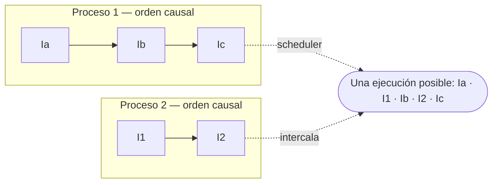

*Cada proceso respeta su orden interno (Ia→Ib→Ic y I1→I2); el interleaving entre procesos es arbitrario. Otras ejecuciones válidas: «Ia·Ib·I1·Ic·I2», «Ia·I1·I2·Ib·Ic», etc. Verificar un programa concurrente es razonar sobre todas las intercalaciones posibles.*

### Los dos desafíos: sincronización y comunicación

- **Sincronización:** coordinación *temporal* entre procesos (quién puede avanzar y cuándo; garantizar exclusión mutua, orden, esperar condiciones).
- **Comunicación:** intercambio de *datos* entre procesos para que el programa cumpla su función (memoria compartida o pasaje de mensajes).

**En el final:** «Definir programa concurrente, proceso e instrucción atómica» y «por qué la salida de un programa concurrente puede variar». Respuesta: porque la ejecución es una intercalación arbitraria de instrucciones atómicas; solo se preserva el orden causal de cada proceso, así que hay múltiples escenarios y la corrección debe valer en *todos*.

<a id="threads"></a>

## 02. Procesos, threads y estados

### Qué comparte un thread y qué no

Los **threads** comparten los recursos del proceso padre —el **espacio de memoria** (código, datos, archivos abiertos)—. Pero cada thread mantiene su propia **información de estado**: su **pila (stack)**, su **contador de programa (PC)** y sus **registros**.

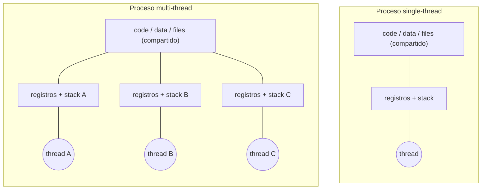

*Todos los threads del proceso ven la misma memoria (por eso pueden pisarse: estado mutable compartido), pero cada uno lleva su propio stack, PC y registros.*

### Proceso vs thread vs tarea asincrónica

|  | Proceso | Thread (hilo) | Tarea asincrónica |
| --- | --- | --- | --- |
| Espacio de memoria | Propio, aislado | Compartido con el proceso | Compartido con el proceso |
| Stack propio | Sí | Sí | No en el sentido clásico: guarda su estado en el *Future*, no en un stack del SO dedicado |
| Lo planifica | Scheduler del SO | Scheduler del SO | El **executor/runtime** en espacio de usuario (cooperativo) |
| Costo de crear | Alto | Medio (~KB de stack c/u) | Muy bajo (miles/decenas de miles) |
| Cambio de contexto | Caro | Medio | Barato (no pasa por el kernel) |

Trampas típicas de V/F (parcial):

«Procesos, hilos y tareas async tienen espacios de memoria independientes» →

Falso

(los hilos y tareas comparten el del proceso). «El scheduler del SO puede pausar una tarea async puntual y habilitar otra del mismo proceso» →

Falso

: las tareas async son

cooperativas

, ceden control solo en un

await

; las maneja el executor, no el scheduler del SO.

### Estados de ejecución de un proceso

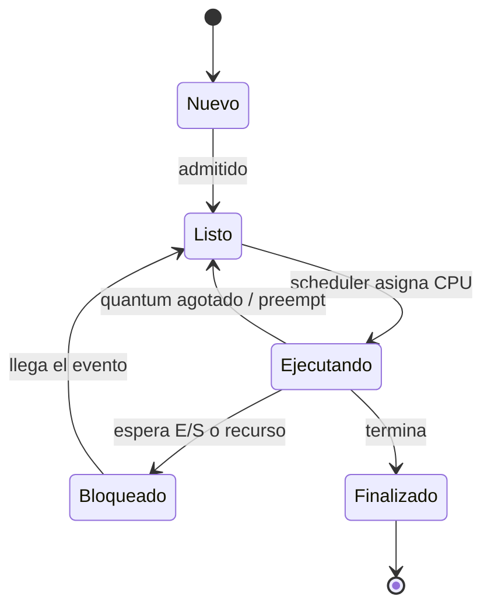

*Un proceso pasa por Nuevo → Listo (ready) → Ejecutando (running) → puede bloquearse (waiting) por E/S o un recurso y volver a Listo → Finalizado (libera sus recursos y permite obtener su estado de finalización).*

**En el final/parcial:** distinguir con precisión qué comparte cada abstracción. Regla mnemotécnica: *proceso = casa propia; threads = compañeros de la misma casa con su propia pieza (stack); tareas async = threads muy livianos y cooperativos que guardan su “pieza” dentro del Future.*

<a id="rust"></a>

## 03. Rust: ownership y seguridad en concurrencia

**Rust** es el lenguaje de la materia. Se enfoca en **velocidad, seguridad y concurrencia**, con *abstracciones sin costo* (zero-cost abstractions): construcciones de alto nivel que no pagan overhead en runtime. Su promesa clave: es **memory safe en tiempo de compilación** —no hay *dangling pointers*— y **previene las condiciones de carrera sobre los datos** (data races) al usar concurrencia, sin costo en ejecución.

### Ownership (pertenencia): las reglas

- Cada valor tiene una variable que es su **dueño (owner)**.
- Solo puede haber **un único dueño a la vez**; cambiar de dueño es un **move** (el anterior deja de ser válido).
- El dueño puede **prestar (borrow)** el valor: o bien **múltiples referencias inmutables** (`&amp;T`), o bien **una única referencia mutable** (`&amp;mut T`) — nunca ambas a la vez.
- Cuando el dueño sale de su **ámbito (scope)**, el valor se libera (**drop**).
- Inspirado en **RAII** (*Resource Acquisition Is Initialization*): el recurso se adquiere al inicializar y se limpia solo al salir de scope.

Por qué esto mata los data races:

«múltiples lectores

o

un solo escritor, nunca las dos cosas» es exactamente la condición que evita una carrera de datos. El

borrow checker

la verifica en compilación, así que un data race clásico ni siquiera compila.

### Punteros inteligentes para el heap

| Tipo | Para qué | Concurrencia |
| --- | --- | --- |
| `Box&lt;T&gt;` | Un único dueño de un valor en el heap. | Un solo hilo. |
| `Rc&lt;T&gt;` | Múltiples dueños compartidos (conteo de referencias) inmutables. | **Un solo hilo** (el contador no es atómico). |
| `Arc&lt;T&gt;` | *Atomic Rc*: múltiples dueños compartidos desde **varios threads**. | Seguro entre hilos (contador atómico). |

Para *mutar* algo compartido entre hilos se combina `Arc` (compartir) con un lock (`Mutex` o `RwLock`) que serializa el acceso: el patrón `Arc&lt;Mutex&lt;T&gt;&gt;`.

```rust
use std::sync::{Arc, Mutex};
use std::thread;

fn main() {
    // Arc: compartir el dueño entre hilos. Mutex: serializar la mutación.
    let contador = Arc::new(Mutex::new(0));
    let mut handles = vec![];

    for _ in 0..10 {
        let contador = Arc::clone(&contador);   // clona el puntero, no el dato
        let h = thread::spawn(move || {
            let mut n = contador.lock().unwrap(); // adquiere el lock (RAII)
            *n += 1;
        }); // aquí el guard se dropea -> se libera el lock
        handles.push(h);
    }
    for h in handles { h.join().unwrap(); }
    println!("total = {}", *contador.lock().unwrap()); // 10, siempre
}
```

### Los traits Send y Sync

- **`Send`:** la propiedad (ownership) del tipo *puede transferirse entre threads*. Casi todos los tipos son `Send`, **excepto** punteros raw y `Rc&lt;T&gt;`.
- **`Sync`:** el tipo puede *referenciarse de forma segura desde varios threads*. Formalmente, `T` es `Sync` si `&amp;T` es `Send`. Los tipos primitivos y los compuestos por tipos `Sync` son automáticamente `Sync`.

Estos traits son

marker traits

: el compilador los deduce. Si intentás mandar un

Rc

a otro thread, el error de compilación es «

Rc&lt;T&gt;

cannot be sent between threads safely»: te está diciendo que uses

Arc

.

**En el final:** explicar cómo Rust previene condiciones de carrera. Idea a decir: las reglas de *ownership/borrowing* imponen «muchos `&amp;T` XOR un `&amp;mut T`» y se chequean en compilación; para compartir mutable entre hilos se usa `Arc&lt;Mutex&lt;…&gt;&gt;`; `Send`/`Sync` definen qué tipos son seguros de mover/compartir entre threads.

<a id="modelos"></a>

## 04. Panorama de modelos y cuándo usar cada uno

Hay varios **modelos de concurrencia**; la habilidad que evalúan los parciales es **elegir el correcto según el problema**. Todos buscan lo mismo (aprovechar concurrencia sin romper la corrección) pero atacan la comunicación y la sincronización de forma distinta.

| Modelo | Idea | Cuándo brilla |
| --- | --- | --- |
| **Estado mutable compartido** | Varios procesos acceden a los mismos datos; se *serializa* el acceso con locks para que solo una ejecución esté en la sección crítica. | Estado central que muchos leen/escriben: contadores, caché, buffers. |
| **Fork-Join / datos** | Dividir un cómputo en subtareas *independientes*, ejecutarlas en paralelo y unir (join) los resultados. | Cómputo **CPU-bound** y divisible: matrices, procesar N archivos, word count. |
| **Canales / mensajes** | Los procesos no comparten memoria; se comunican enviando mensajes por canales. | Pipelines productor-consumidor, transferir ownership de datos. |
| **Asincrónico (async/await)** | Un hilo atiende muchas tareas livianas que ceden control mientras esperan. | **I/O-bound**: miles de conexiones, requests a APIs, servir HTTP. |
| **Actores** | Entidades aisladas con estado privado que se comunican *solo* por mensajes asincrónicos. | Dominio con muchas entidades con estado y lógica: juegos, chat, simulaciones. |

Pregunta que decide casi todo: ¿el trabajo es CPU-bound o I/O-bound?

Si el cuello de botella es

calcular

(CPU), querés paralelismo real (fork-join, threads, SIMD/GPU). Si el cuello de botella es

esperar

(red, disco), querés async (muchas esperas baratas en pocos hilos). Poner async a un cómputo pesado no acelera nada; poner mil threads a esperar red desperdicia memoria.

### Casos reales de parcial resueltos

**«Renderizado de videos 3D en alta resolución, usando programación asincrónica»**

**Mala elección.** El renderizado es *CPU-bound* intensivo. Async no ayuda: una tarea que computa sin llegar a un `await` no cede el control, así que no gana concurrencia y encima agrega complejidad. **Usaría** paralelismo de datos / fork-join sobre múltiples núcleos (Rayon), o directamente **vectorización/GPU (CUDA)**, que es exactamente el caso de «mismo cómputo sobre muchos píxeles independientes».

**«Nube de palabras desde la API de Twitter, usando barriers y mutex»**

**Elección subóptima.** Traer tweets es *I/O* (mejor async o un pool de threads); contar palabras es un **MapReduce / fork-join** (map: contar por chunk; reduce: sumar). Sincronizar todo con `barriers + mutex` serializa de más e introduce contención innecesaria. **Usaría** async para las requests y fork-join/MapReduce para el conteo, combinando con `reduce`.

**«Votación en vivo para un concurso de TV, optimizada con Vectorización»**

**Mala elección.** La vectorización (SIMD) sirve para aplicar *el mismo cálculo* a un gran vector de datos *independientes*; una votación es **agregación concurrente con mucha escritura** a contadores compartidos. **Usaría** estado mutable compartido con contadores atómicos / `Arc&lt;Mutex&gt;` por opción (o actores, uno por candidato), y async para recibir los votos entrantes.

**Mini-tabla de “qué modelo para…”**

| Caso | Modelo |
| --- | --- |
| Cálculo de matrices para redes neuronales | Vectorización / SIMD / GPU (fork-join de datos) |
| Pedir a varias APIs y combinar el resultado | Async (lanzar futures y `join`) |
| Leer el log de una página muy visitada | Async (I/O) o lector-escritor con `RwLock` |
| Backend de un videojuego | Actores (una entidad = un actor) |
| Convertir muchos .DOC a .PDF | Fork-join / pool de threads (CPU-bound, independiente) |
| Backend de Menti/Kahoot competitivo | Actores (estado por sala, mensajes) |
| Caché para reducir requests a la DB | Estado compartido con `RwLock` (muchas lecturas) |
| API HTTP que corre un modelo NLP | Async para servir + `spawn_blocking` para el cómputo |

**En el parcial:** siempre justificar con *CPU-bound vs I/O-bound* y con «¿hay estado compartido que serializar o entidades que se comunican?». No basta nombrar el modelo: hay que dar ventaja y desventaja y decir cuál elegirías.

<a id="forkjoin"></a>

## 05. Fork-Join y paralelismo de datos

**Fork-Join** es un estilo de paralelización donde un cómputo grande (*task*) se divide **recursivamente** en subtareas más chicas (*subtasks*) que se ejecutan en paralelo, y cuyos resultados se combinan (**join**) en la solución final.

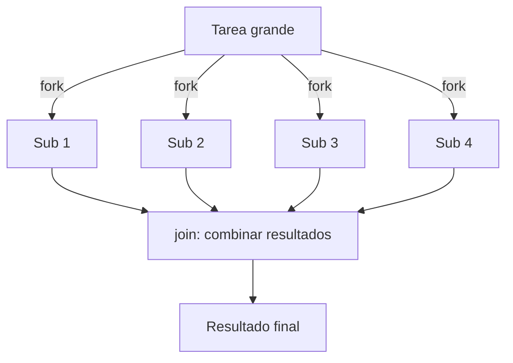

*Divide y vencerás en paralelo. Las subtareas son independientes; solo se bloquean para esperar a otras subtareas.*

### Propiedades (¡esto se pregunta!)

- **Sin condiciones de carrera:** las unidades de trabajo están *aisladas*.
- **Determinístico:** produce el mismo resultado sin importar las velocidades relativas de los threads.
- **Threads aislados** entre sí.
- **Rendimiento:** idealmente el tiempo secuencial se divide por el número de threads (limitado por el desbalance de tareas y el costo del *join*).
- **Desventaja:** exige que las unidades de trabajo sean aisladas (no sirve si hay mucho estado compartido).

### Work stealing (robo de trabajo)

Algoritmo de *scheduling* para balancear la carga entre workers: cada thread tiene su propia cola doble (**deque**). Cuando genera subtareas las apila al **final** de su cola; cuando se queda sin trabajo, **roba** tareas del **inicio** de la cola de otro thread (elegido al azar). Minimiza la sincronización entre workers y tiene bajo overhead.

### Implementaciones en Rust

- `std::thread::spawn`: lanzar threads del SO manualmente.
- **Rayon:** paralelismo de datos casi gratis: convertir `iter()` en `par_iter()`. Internamente crea un worker por núcleo e implementa work stealing; combina con `reduce()` / `reduce_with()`.
- **Crossbeam:** estructuras y utilidades de concurrencia. `crossbeam::scope` crea un ámbito que garantiza que los threads terminen antes de que el closure retorne (permite prestar referencias del stack).

```rust
use rayon::prelude::*;

// Secuencial -> paralelo con solo cambiar iter() por par_iter()
let total: u64 = (0..1_000_000u64)
    .into_par_iter()
    .map(|x| x * x)
    .reduce(|| 0, |a, b| a + b);   // reduce combina resultados parciales
```

### MapReduce, Dremel y vectorización

- **MapReduce** (Google, 2004): modelo para procesar grandes datasets. El usuario define **map** (procesa un par clave/valor y emite pares intermedios) y **reduce** (combina todos los valores de una misma clave). Su «Hello World» es el **conteo de palabras (Word Count)**.
- **Dremel**: consultas en tiempo casi real (expuesto como *BigQuery*); la consulta se «empuja» y reescribe por un árbol jerárquico y los resultados se ensamblan agregando las respuestas de los niveles inferiores.
- **Vectorización (SIMD, *Single Instruction, Multiple Data*)**: aplicar el mismo cómputo simple a muchos datos independientes a la vez. Ante la ralentización de la **Ley de Moore**, los transistores extra se usaron en varias ALUs sobre los mismos registros → instrucciones SIMD (MMX/SSE/AVX en x86, NEON en ARM). Los registros son vectores de tamaño fijo (128–512 bits) divididos en **carriles (lanes)**. Operaciones «verticales» (entre registros, mismo carril: `x0+y0`) son eficientes; las «horizontales» (reducir un vector a un escalar: `x0+x1+x2+x3`) son más lentas. Ideal para sonido, imágenes, video y entrenar redes neuronales.
- **CUDA**: estándar de facto de NVIDIA para GPUs; modela «threads» en bloques que operan sobre porciones de memoria independientes (direccionables en 1D/2D/3D), permitiendo miles de threads concurrentes.

**En el final:** propiedades de fork-join (determinístico, sin races, aislado), qué es work stealing (deque, robar del inicio de otra cola) y por qué SIMD/GPU sirven para «mismo cómputo sobre muchos datos independientes» y no para lógica con estado compartido.

<a id="async"></a>

## 06. Programación asincrónica (async/await)

Las **tareas asincrónicas** permiten manejar concurrencia de forma mucho más liviana que los threads, sobre todo para **operaciones de E/S**. **El problema de los threads:** si una app crea muchísimos threads, la memoria de sus *stacks* (p. ej. ~100 KB c/u) se vuelve un problema. Las tareas async son mucho más livianas (miles o decenas de miles), más rápidas de crear y con menor overhead de memoria; un hilo puede tomar otras tareas mientras una espera que se complete una llamada al sistema.

### Futures y el modelo piñata

Un **`Future`** (trait `std::future::Future`) representa una operación que se puede *probar* si terminó, mediante `poll`:

- `poll` **nunca bloquea**. Si la operación terminó retorna `Poll::Ready(out)`; si no, `Poll::Pending`.
- El future almacena todo lo necesario para hacer el pedido y **el punto donde retomar** en el próximo `poll`, más su estado local.
- Se llama a `poll` **solo cuando es probable que la tarea progrese** (lo decide el runtime, avisado por el reactor de E/S).

Modelo piñata:

al

Future

«se lo golpea» con

poll

hasta que

cae

el valor. Es

cooperativo

: la tarea solo cede control en los puntos

await

; nadie la interrumpe por la fuerza.

```mermaid
stateDiagram-v2
    [*] --> Pending
    Pending --> Pending: poll() -> aún no listo
    Pending --> Ready: poll() -> Poll::Ready(out)
    Ready --> [*]: devuelve el valor
          
```

*El executor pollea el future; mientras esté Pending lo deja «dormido» y atiende otras tareas; cuando el reactor avisa que puede progresar, lo vuelve a pollear.*

### Funciones async y expresiones await

- Invocar una función `async` **retorna inmediatamente un `Future`**, *antes* de ejecutar el cuerpo. El future contiene argumentos, variables locales, etc.
- La **primera vez que se pollea**, el cuerpo corre hasta el primer `await`.
- `await` toma la propiedad del `Future` interno y lo pollea: si está `Ready`, sigue con su valor; si está `Pending`, la función que espera también retorna `Pending` (propaga la suspensión).
- `await` solo puede usarse dentro de funciones `async`.

```rust
async fn bajar(url: &str) -> String { /* ... */ }

async fn combinar() -> usize {
    // Se lanzan los dos futures y se esperan concurrentemente con join.
    let (a, b) = futures::join!(bajar("api/1"), bajar("api/2"));
    a.len() + b.len()
}
```

### Executors y runtimes

| Primitiva | Qué hace |
| --- | --- |
| `block_on(fut)` | Función **sincrónica** que espera el valor final de un future: adapta el mundo async al sync. **No usar dentro de un `async`** (bloquearía todo el thread). |
| `spawn_local(fut)` | Agrega el future a un pool que se pollea en el `block_on` (análogo a `spawn` de threads, mismo hilo). |
| `spawn(fut)` | Crea la tarea y la coloca en el pool de threads dedicado a pollear futures; no necesita `block_on`. |
| `spawn_blocking(f)` | Manda la tarea a **otro thread del SO** para cómputo pesado o bloqueante, sin frenar el executor. |
| `yield_now()` | Cede voluntariamente el control a otra tarea (favorece el paralelismo cooperativo). |

Un **runtime** (Tokio, async-std) trae el **executor** (traduce `await` en llamadas a `poll` y gestiona hilos) más bibliotecas de E/S asincrónica, timers, locks y canales.

### Pin y Unpin (por qué existen)

Los tipos autogenerados de `async` que implementan `Future` guardan **referencias a sí mismos** (self-references) para recordar dónde retomar. Si se *movieran* en memoria, esas referencias internas quedarían colgadas. `Pin&lt;T&gt;` «clava» un valor `!Unpin` para impedir que se mueva. Por defecto casi todos los tipos son `Unpin`.

### Cuándo (y cuándo no) usar async

Sí:

tareas

I/O-intensivas

—consultar servicios externos, leer archivos, servir requests HTTP— donde la mayor parte del tiempo se

espera

.

No:

cómputo

CPU-intensivo

(factoriales, producto de matrices). Un cómputo grande dentro de un

async

no llega a un

await

y por lo tanto

no cede el control

a otras tareas → mata la concurrencia. Para eso,

spawn_blocking

o fork-join.

Dato fino: los futures son **functors** (se pueden `map`) y **monads** (se pueden `flatten`), y se encadenan/combinan con `join`.

**Trampas de V/F frecuentes:** «El que hace poll es el thread principal» → *Falso*, lo hace el **executor/runtime**. «poll se llama solo cuando la tarea puede progresar» → *Verdadero*. «El modelo piñata es colaborativo» → *Verdadero* (cooperativo). «La operación async inicia al llamar a la función `async`» → *Falso*: al invocarla solo se crea el `Future`; recién arranca al primer `poll`/`await`.

<a id="mensajes"></a>

## 07. Mensajes, canales y modelo de actores

Principio fundamental:

«No comunicarse compartiendo memoria; en cambio, compartir memoria comunicándose.» En vez de que varios toquen el mismo dato (y haya que serializar con locks), un único dueño posee el dato y los demás le mandan mensajes.

### Modelos de comunicación

- **Sincrónica:** el emisor *espera* a que el receptor esté listo para recibir (rendezvous).
- **Asincrónica (buffer):** los mensajes se guardan en un buffer; el emisor sigue sin esperar al receptor.
- **Direccionamiento:** *simétrico* (emisor y receptor se conocen), *asimétrico* (el emisor conoce al receptor pero no al revés), *sin direccionamiento* (matcheo por estructura del mensaje).
- **Flujo de datos:** unidireccional o bidireccional.

### Canales (channels)

Un **canal** conecta un proceso emisor con uno receptor. Propiedades:

- Tienen **nombre** y son **tipados**.
- Pueden ser **sincrónicos o asincrónicos**.
- Son **unidireccionales**.
- Permiten **múltiples productores para un solo consumidor** (MPSC), clonando el extremo de envío.
- **Transfieren la propiedad (ownership)** del elemento enviado (encaja perfecto con Rust).
- **Selective input:** escuchar varios canales de forma bloqueante y desbloquearse con el primero que reciba un mensaje.

```rust
use std::sync::mpsc;   // multiple producer, single consumer
use std::thread;

let (tx, rx) = mpsc::channel();
for id in 0..3 {
    let tx = tx.clone();               // varios productores
    thread::spawn(move || tx.send(format!("hola de {id}")).unwrap());
}
drop(tx);                              // cierro el original para que rx termine
for msg in rx {                        // el consumidor itera hasta que se cierran todos los tx
    println!("{msg}");
}
```

### Canales en Unix y RPC

- **Pipes y FIFOs:** conectan dos procesos independientes, orientados a *bytes*. Los FIFOs tienen representación en el sistema de archivos.
- **Colas de mensajes:** orientadas a *mensajes* como unidades independientes.
- **RPC (Remote Procedure Call):** un cliente ejecuta funciones en un servidor de otro procesador. Requiere **stubs** en ambos extremos, **localización** del servicio y **parameter marshalling** (serializar argumentos/resultados).

### Modelo de actores

Desarrollado por **Carl Hewitt (1973)** y popularizado por **Erlang**. La primitiva es el **actor**: liviano (se crean miles, a diferencia de los threads), **encapsula estado y comportamiento**.

- **Dirección (address):** forma de enviarle mensajes al actor (puede ser remota en un sistema distribuido).
- **Mailbox (casilla):** un **FIFO** de los mensajes recibidos.
- Un actor **supervisor** puede crear actores hijos.
- **Aislados:** no comparten memoria con otros actores; su estado privado **solo se modifica procesando mensajes** y procesan **un mensaje a la vez** (esto elimina las condiciones de carrera por diseño).

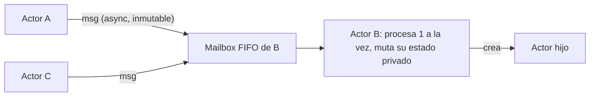

*Los actores solo se comunican por mensajes asincrónicos e inmutables; la mailbox serializa el acceso al estado sin locks explícitos.*

#### Mensajes en Actix

Los mensajes son estructuras simples e **inmutables**, procesadas de forma **asincrónica**; deben implementar el trait `Message`, que define el tipo de retorno (`Message::Result`). Formas de envío:

| Método | Comportamiento |
| --- | --- |
| `Addr::do_send(M)` | Ignora errores y no retorna resultado; el mensaje se descarta si la casilla está cerrada. |
| `Addr::try_send(M)` | Intenta enviar ya; retorna `SendError` si la casilla está *llena* o cerrada. |
| `Addr::send(M)` | Retorna un `Future` con el **resultado** del manejo del mensaje. |

- **Contexto:** estado interno de ejecución del actor; le permite conocer su propia dirección, cambiar el límite de su mailbox o detenerse.
- **Arbiter:** provee el contexto de ejecución asincrónica; aloja el entorno del actor creando threads del SO y corriendo *event loops*.

#### Ciclo de vida de un actor (Actix)

```mermaid
stateDiagram-v2
    [*] --> Started: started() — contexto disponible
    Started --> Running: estado normal (puede ser indefinido)
    Running --> Stopping: Context::stop() / sin addr que lo referencien / sin objetos en el contexto
    Stopping --> Running: stopping() devuelve Running (se reanuda)
    Stopping --> Stopped: stopped() — último estado
    Stopped --> [*]
          
```

*Started (se llama started(), ya hay contexto) → Running → Stopping (al llamar Context::stop(), o si nadie tiene su dirección, o si no quedan objetos registrados en el contexto) → Stopped.*

```rust
use actix::prelude::*;

// Mensaje inmutable con su tipo de resultado
#[derive(Message)]
#[rtype(result = "usize")]
struct Sumar(usize, usize);

struct Calculadora { hechas: usize }        // estado privado

impl Actor for Calculadora {
    type Context = Context<Self>;
    fn started(&mut self, _ctx: &mut Self::Context) {
        println!("actor iniciado");         // ciclo de vida: Started
    }
}

impl Handler<Sumar> for Calculadora {
    type Result = usize;
    fn handle(&mut self, msg: Sumar, _ctx: &mut Context<Self>) -> usize {
        self.hechas += 1;                    // un mensaje a la vez: sin data races
        msg.0 + msg.1
    }
}

#[actix::main]
async fn main() {
    let addr = Calculadora { hechas: 0 }.start();   // Addr del actor
    let r = addr.send(Sumar(2, 3)).await.unwrap();  // send -> Future con el resultado
    println!("{r}");                                 // 5
}
```

### Diseñar un sistema con actores (patrón de examen)

Los finales piden diseñar sistemas con actores definiendo, por cada entidad, su **estado interno** y los **mensajes** que intercambia. Ejemplo del *restaurante*: **Cliente**, **Mozo**, **Cocinero** y el **Depósito** (recurso de acceso exclusivo, de a uno).

| Actor | Estado interno | Mensajes que recibe / envía |
| --- | --- | --- |
| Cliente | mesa, pedido, si ya pagó | recibe `Atendido`, `PlatoListo`; envía `Pedir`, `PedirCuenta` |
| Mozo | disponible/ocupado, mesas asignadas | recibe `Pedir`, `PlatoListo`, `PedirCuenta`; envía `NuevoPedido` a Cocina, `Atendido`/entrega al Cliente |
| Cocinero | pedido en preparación | recibe `NuevoPedido`; pide acceso al Depósito; al terminar envía `PlatoListo` al Mozo |
| Depósito | ocupado/libre (acceso exclusivo) | recibe `TomarIngredientes`/`Liberar` (serializa el acceso de a uno) |

**En el final:** «motivación del modelo de actores, características y ciclo de vida en Actix». Motivación: evitar el estado mutable compartido y sus locks; cada actor es dueño de su estado y solo cambia procesando mensajes (uno a la vez) → sin races por diseño, escala a miles de entidades livianas, encaja en sistemas distribuidos (dirección remota). Características: aislados, mailbox FIFO, mensajes asincrónicos e inmutables, supervisión. Ciclo: Started → Running → Stopping → Stopped.

<a id="correccion"></a>

## 08. Corrección: safety y liveness

La corrección de un programa concurrente es difícil porque la salida puede depender del **escenario** de ejecución, no solo de la entrada. Se demuestra probando dos clases de propiedades:

Safety (seguridad):

«algo malo

nunca

pasa». Debe ser verdadera

siempre

. Incluye

exclusión mutua

(dos procesos no intercalan ciertas subsecuencias, p. ej. tocar una variable compartida) y

ausencia de deadlock

(un sistema no finalizado siempre puede seguir productivamente).

Liveness (vivacidad):

«algo bueno

eventualmente

pasa». Debe volverse verdadera en algún momento. Incluye

ausencia de starvation

(todo proceso listo para usar un recurso eventualmente lo recibe) y

fairness

(si una instrucción está continuamente habilitada, eventualmente aparece en el escenario).

### Los cuatro problemas a comparar (pregunta de final)

| Fenómeno | Qué es | ¿El sistema avanza? | Causa / arreglo |
| --- | --- | --- | --- |
| **Busy-wait** (espera activa) | Un proceso *gira* en un loop chequeando una condición y **consume CPU** sin trabajo útil. | Sí, pero desperdicia CPU | Reemplazar el spin por bloqueo real (semáforo, condvar, `park`) o al menos ceder CPU. |
| **Race condition** (carrera) | El resultado depende del *timing* de accesos **no sincronizados** a estado compartido. | Sí, pero da resultados incorrectos/no deterministas | Serializar el acceso (lock/semáforo/actor). |
| **Deadlock** (interbloqueo) | Dos+ procesos se esperan mutuamente por recursos que el otro tiene; **ninguno** avanza. | No (se traba todo) | Romper una condición de Coffman (p. ej. ordenar la toma de recursos). |
| **Starvation** (inanición) | Un proceso listo **nunca** obtiene el recurso porque otros lo acaparan. | Sí, pero ese proceso queda afuera | Política *fair* (colas FIFO, envejecimiento). |

Distinción fina que piden:

deadlock ≠ starvation. En deadlock

nadie

avanza (falla de safety/liveness global); en starvation el sistema

sí

progresa pero un proceso concreto es postergado para siempre (falla de liveness individual). Un busy-wait puede

funcionar

pero es «espera activa» que quema CPU; una race puede dar el resultado correcto por casualidad en algunas corridas y mal en otras.

**Condiciones de Coffman** (las cuatro que deben darse juntas para un deadlock): exclusión mutua, *hold &amp; wait* (retener y esperar), *no preemption* (no expropiación) y **espera circular**. Basta impedir una para prevenirlo.

### Sección crítica (SC)

Una **sección crítica** es un bloque donde los procesos acceden a recursos compartidos. El **problema de la sección crítica** exige:

- **Exclusión mutua:** las instrucciones de la SC no se intercalan (a lo sumo un proceso adentro).
- **Ausencia de deadlock:** si dos intentan entrar, al menos uno lo logra eventualmente.
- **Ausencia de starvation:** si un proceso intenta entrar, eventualmente entra.
- **Progreso:** la SC debe avanzar y finalizar (nadie se queda adentro para siempre).

### ¿Es un busy-wait? (patrón de parcial)

La clave: ¿el loop **cede la CPU** (sleep/yield/bloqueo) o **gira sin hacer nada útil**?

NO es busy-wait

si entre intento e intento hay

thread::sleep

, si se bloquea en un lock/semáforo, o si en cada vuelta hace

trabajo útil

(p. ej. minar y escribir un resultado, reintentar una conexión con espera).

SÍ es busy-wait

si es un

loop { if cond { break } }

apretado que revisa una condición sin dormir ni bloquear: gasta 100% de CPU esperando.

```rust
// NO es busy-wait: hace trabajo y cede CPU con sleep
loop {
    let mined = rng.gen();
    *mineral.write().unwrap() += mined;            // trabajo útil
    thread::sleep(Duration::from_millis(delay));   // cede la CPU
}

// SÍ es busy-wait: gira sin ceder ni producir nada
loop {
    if *listo.lock().unwrap() { break; }           // spin apretado -> quema CPU
}
```

**En el final:** «explicar y comparar busy-wait, deadlock, race condition y starvation». Ejes para ordenar la respuesta: (1) ¿consume CPU inútilmente? → busy-wait; (2) ¿resultado depende del timing? → race; (3) ¿todos trabados esperándose? → deadlock; (4) ¿uno queda postergado para siempre mientras el resto avanza? → starvation.

<a id="locks"></a>

## 09. Locks y RwLock

Los **locks (cerraduras)** implementan exclusión mutua entre procesos. Se usan con una variable de tipo lock que guarda su estado:

- `lock()`: el proceso **se bloquea** hasta poder obtener el lock.
- `unlock()`: libera el lock previamente tomado.
- Requieren soporte de **hardware y sistema operativo** (instrucciones atómicas tipo *test-and-set*).

### Locks en Unix

- Son **advisory** (consultivos): los procesos *pueden* ignorarlos; funcionan solo si todos cooperan. Sirven para sincronizar acceso a archivos o cualquier recurso.
- **Shared locks (lectura):** varios procesos pueden tenerlo simultáneamente.
- **Exclusive locks (escritura):** uno solo a la vez, bloquea a todos.
- Para tomar un *shared* hay que esperar que se liberen todos los *exclusive*; para un *exclusive*, que se liberen **todos** (de ambos tipos).
- Se aplican abriendo el archivo y usando `fcntl()`, `flock()` o `lockf()`.

### RwLock en Rust (std::sync::RwLock)

Provee locks **compartidos (lectura)** y **exclusivos (escritura)**; la política concreta depende del SO. Para compartir `T` entre threads, `T` debe ser `Send`, y para permitir lectores concurrentes, `Sync`.

- `read()`: bloquea hasta obtener lock de lectura (puede haber otros lectores).
- `write()`: bloquea hasta obtener lock de escritura (no puede haber ningún otro lock).
- Ambos devuelven un **guard** que libera el lock **automáticamente** al salir de scope (patrón RAII, trait `Drop`).

```rust
use std::sync::RwLock;

let datos = RwLock::new(vec![1, 2, 3]);
{
    let r1 = datos.read().unwrap();   // varios lectores a la vez
    let r2 = datos.read().unwrap();
    println!("{} {}", r1.len(), r2.len());
} // se liberan los guards de lectura
{
    let mut w = datos.write().unwrap(); // acceso exclusivo
    w.push(4);
} // se libera el guard de escritura (Drop)
```

Locks envenenados (poisoned):

si un thread que tomó el lock de forma

exclusiva

hace

panic!

mientras lo tiene, el lock queda

envenenado

: las llamadas posteriores a

read()

/

write()

devuelven

Err

. Es la razón por la que en Rust casi siempre ves

.lock().unwrap()

: estás propagando (o manejando) ese posible envenenamiento.

**Mutex** es el caso exclusivo puro (equivalente a un lock de escritura o semáforo binario). El patrón para mutar estado compartido entre hilos es `Arc&lt;Mutex&lt;T&gt;&gt;` (compartir + serializar).

**En el final:** diferencia shared vs exclusive, por qué los locks de Unix son *advisory*, y el patrón RAII: el guard libera solo → menos bugs de «me olvidé el `unlock()`». Mencionar poisoning como propiedad de seguridad de Rust.

<a id="semaforos"></a>

## 10. Semáforos, barreras y monitores

Son mecanismos de sincronización de más alto nivel para coordinar el acceso a recursos compartidos. Sirven para **evitar el busy-wait**, las condiciones de carrera y para garantizar comportamiento determinista.

### Semáforos

Un semáforo es un tipo con un entero no negativo **`V`** y un conjunto de procesos bloqueados **`L`**. Se inicializa con `k &gt;= 0` y `L` vacío. Actúa como **contador de recursos disponibles**: `V &gt; 0` hay recursos; `V &lt;= 0` no. Dos operaciones **atómicas**:

| Operación | Semántica |
| --- | --- |
| `wait(S)` / `p(S)` | Si `V &gt; 0`, lo decrementa y el proceso continúa. Si `V == 0`, el proceso **se bloquea** y se agrega a `L`. |
| `signal(S)` / `v(S)` | Si `L` está vacío, incrementa `V`. Si no, despierta a uno de `L` y lo pasa a *ready*. |

- **Semáforo binario / Mutex:** `V` solo puede ser 0 o 1; se comporta como un lock de escritura.
- **Invariantes:** `S.V &gt;= 0` y `S.V = k + #signal(S) - #wait(S)` (con `k` el valor inicial). Sirven para demostrar corrección.
- Tipos: **System V** y **POSIX**. En Rust: crate `std-semaphore` con `new(k)`, `acquire()`, `release()`, `access()` (RAII).

### Barreras (std::sync::Barrier)

Sincronizan varios threads en un **punto específico** del cómputo: nadie sigue hasta que *todos* llegan.

- `Barrier::new(n)`: barrera para `n` threads. `wait()`: bloquea hasta que los `n` lleguen.
- Uno de los threads se designa **líder** (`BarrierWaitResult::is_leader()`).
- Las barreras son **reutilizables** automáticamente.

### Monitores

Un **monitor** combina **exclusión mutua** (solo un proceso ejecuta un procedimiento del monitor a la vez) con la capacidad de **esperar a que una condición se cumpla**. Componentes: nombre, variables internas *protegidas*, procedimientos que acceden a esas variables, interfaz pública, inicialización y **variables de condición**.

Las **variables de condición** (`C`) **no guardan valor**; tienen asociado un **FIFO** de procesos:

- `waitC(cond)`: **siempre bloquea** al proceso, lo agrega al FIFO de la condición y **libera el lock del monitor**.
- `signalC(cond)`: despierta al proceso del **tope del FIFO** si la cola no está vacía; si está vacía, **no tiene efecto**.
- `empty(cond)`: indica si el FIFO está vacío.

#### Semáforo vs Monitor (comparación de final)

| Aspecto | Semáforo (`wait`/`signal`) | Monitor (`waitC`/`signalC`) |
| --- | --- | --- |
| ¿`wait` bloquea? | Puede o no (si `V &gt; 0` no bloquea) | `waitC` **siempre** bloquea |
| ¿`signal` tiene efecto? | Siempre (incrementa o despierta) | `signalC` **no** tiene efecto si la cola está vacía |
| ¿A quién despierta? | Un proceso *arbitrario* de `L` | El del **tope del FIFO** |
| Tras la señal | El desbloqueado puede continuar enseguida | El desbloqueado **espera** a que el señalizador deje el monitor |

#### Monitores en Java, volatile y spurious wakeup

- **`synchronized`** (bloque o método): cada objeto tiene un *lock/monitor*; solo un hilo lo toma a la vez y es **reentrante**.
- `wait()`: libera el monitor y suspende el hilo hasta que otro llame `notify()`/`notifyAll()`. Para llamarlos hay que **tener el monitor adquirido**.
- `volatile`: indica que la variable **no se cachee** y se lea siempre de memoria principal (visibilidad entre hilos). **No hace ningún lock.**
- **Spurious wakeup:** un hilo puede despertarse *sin* que nadie haya hecho `notify` (timers, señales, detalles de bajo nivel). Por eso el `waitC` se pone dentro de un **`while`** que revuelve a chequear la condición, nunca dentro de un `if`.

Error clásico de parcial:

usar

if condición { wait() }

en vez de

while condición { wait() }

. Con

if

, ante un spurious wakeup (o varios waiters despertados por

notify_all

) el proceso sigue sin que la condición se cumpla → bug.

Siempre

while

.

### Armar un semáforo con monitores (ejercicio típico)

```rust
// Un Mutex&lt;i32&gt; + Condvar ES, en esencia, un semáforo contador implementado
// como monitor. La condición "hay recursos" se espera con while (no if).
use std::sync::{Mutex, Condvar};

struct Semaforo { mtx: Mutex<i32>, cond: Condvar }

impl Semaforo {
    fn new(k: i32) -> Self { Semaforo { mtx: Mutex::new(k), cond: Condvar::new() } }

    fn acquire(&self) {                 // wait / p
        let mut v = self.mtx.lock().unwrap();
        while *v == 0 {                 // WHILE: protege de spurious wakeups
            v = self.cond.wait(v).unwrap();
        }
        *v -= 1;
    }

    fn release(&self) {                 // signal / v
        let mut v = self.mtx.lock().unwrap();
        *v += 1;
        self.cond.notify_one();
    }
}
```

**En el final:** «describir cómo se implementan los monitores y sus métodos, y compararlos con semáforos». Puntos que no pueden faltar: variables de condición sin valor + FIFO; `waitC` siempre bloquea y libera el monitor; `signalC` no hace nada si la cola está vacía; y el `while` por spurious wakeup. Reconocer que `Mutex + Condvar` = monitor/semáforo.

<a id="clasicos"></a>

## 11. Problemas clásicos de sincronización

### Productor–Consumidor

Dos familias de procesos —**productores** (generan ítems) y **consumidores** (los procesan)— interactúan a través de un **buffer**. Requisitos: no consumir lo que no hay, que todo ítem producido se consuma eventualmente, acceso al buffer de a uno, y orden **FIFO**. Los problemas de sincronización son *buffer vacío* (no se puede consumir) y *buffer lleno* (no se puede producir).

- **Buffer infinito:** alcanza controlar que no se consuma vacío → un semáforo `notEmpty` (inicial 0).
- **Buffer acotado:** dos semáforos, `notEmpty` (para consumidores, inicial 0) y `notFull` (para productores, inicial `N`), más un `mutex` para el acceso exclusivo al buffer.

```rust
// Buffer acotado con semáforos (pseudocódigo Rust)
let not_full  = Semaphore::new(N);   // huecos libres
let not_empty = Semaphore::new(0);   // ítems disponibles
let buffer    = Mutex::new(VecDeque::new());

// Productor
loop {
    let item = producir();
    not_full.acquire();                        // espera si está lleno
    buffer.lock().unwrap().push_back(item);    // sección crítica
    not_empty.release();                       // avisa: hay un ítem
}
// Consumidor
loop {
    not_empty.acquire();                       // espera si está vacío
    let item = buffer.lock().unwrap().pop_front().unwrap();
    not_full.release();                        // avisa: hay un hueco
    consumir(item);
}
```

### El barbero dormilón

Un barbero **duerme** si no hay clientes; cuando llega uno, si el barbero está libre lo despierta y lo atiende; si está ocupado, el cliente **espera en una silla** (si hay). Modela sincronización entre un servidor que se bloquea cuando no hay trabajo y clientes que llegan asincrónicamente (semáforos: clientes esperando, barbero listo, mutex de sillas).

### Los filósofos comensales

Filósofos que alternan entre **pensar** y **comer**. Para comer necesitan **dos palillos** (los adyacentes), que son recursos compartidos. Si todos toman primero el palillo izquierdo, se produce **deadlock** (espera circular); una política injusta genera **starvation**.

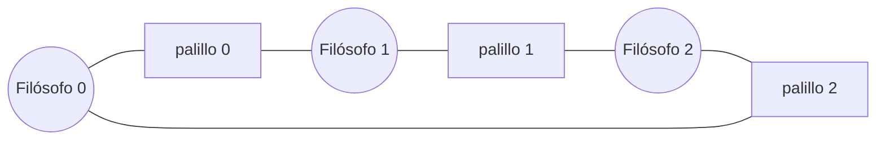

*Cada filósofo comparte un palillo con cada vecino. Soluciones al deadlock: (a) ordenar los recursos y tomar siempre primero el de menor índice; (b) que un filósofo tome en orden inverso; (c) permitir a lo sumo N-1 sentados a la mesa; (d) un mozo/mutex que dé permiso para agarrar de a pares.*

### Los fumadores (Patil)

Tres fumadores, cada uno con un ingrediente infinito distinto (**tabaco**, **papel**, **fósforos**). Un *agente* pone dos ingredientes aleatorios en la mesa; el fumador que tiene el **tercero** los toma, arma el cigarrillo y fuma. Ejercita despertar selectivamente al proceso correcto según la combinación disponible.

### Lectores–Escritores

Varios procesos comparten un estado. Reglas: **múltiples lectores** pueden acceder simultáneamente; si un **escritor** accede, **nadie** más (lector o escritor) puede. Aparece starvation según la política:

- **Preferencia de lectores:** mientras haya lectores, los escritores esperan → puede hambrear escritores.
- **Preferencia de escritores (writer preference):** si hay un escritor esperando, los nuevos lectores esperan → puede hambrear lectores.
- **Fair:** se respeta un orden (p. ej. FIFO) para que ninguno se muera de hambre.

Es exactamente lo que ofrece

RwLock

(capítulo 09):

read()

= lock compartido,

write()

= lock exclusivo. La política de preferencia depende del SO.

**En el parcial:** te dan una red de Petri o un fragmento de código y tenés que **reconocer el problema** (casi siempre productor-consumidor o lector-escritor) y decir si la implementación es correcta o cómo mejorarla. Memorizá los semáforos de cada uno: `notEmpty`/`notFull` para productor-consumidor acotado.

<a id="petri"></a>

## 12. Redes de Petri

Las **Redes de Petri** son una herramienta **gráfica y matemática** para modelar y analizar sistemas concurrentes o distribuidos. Permiten razonar formalmente sobre estados alcanzables, exclusión mutua y deadlocks.

### Red Ordinaria de Petri

Se define como `PN = (T, P, A)`:

- **`P` — Lugares:** estados/condiciones del sistema (se dibujan como círculos).
- **`T` — Transiciones:** eventos que causan cambios de estado (barras/rectángulos).
- **`A` — Arcos:** conectan lugares con transiciones y transiciones con lugares (nunca lugar-lugar ni transición-transición).
- **Marca `M`:** asigna a cada lugar un número no negativo de **tokens**, `M : P → N ∪ {0}`. Es el *estado actual* del sistema.
- **Funciones de Entrada `I(t)` y Salida `O(t)`:** para cada transición `t`, `I(t)` son sus lugares de *entrada* (precondiciones) y `O(t)` los de *salida* (postcondiciones).

Regla de disparo (ordinaria):

una transición está

habilitada

si

todos

sus lugares de entrada tienen al menos un token. Al

dispararse (fire)

, consume un token de cada lugar de entrada y produce un token en cada lugar de salida. El

grafo de alcance

representa todos los estados (marcas) alcanzables y las transiciones entre ellos.

**Interpretaciones:** los lugares pueden ser precondiciones, datos, señales o buffers de entrada; las transiciones, eventos, cómputos o procesamiento de señales; los lugares de salida, postcondiciones, datos/señales/buffers de salida.

### Red General de Petri

Se define como `PN = (T, P, A, W, M0)`, agregando:

- **`W : A → N` (peso):** cada arco tiene un peso (número de tokens que transporta).
- **`M0 : P → N ∪ {0}` (marca inicial):** la configuración de tokens al arrancar.

Regla de disparo (general):

t

está habilitada si

M(p) &gt;= W(p, t)

para todo lugar de entrada

p

. Al dispararse, consume

W(p, t)

tokens de cada entrada y produce

W(p', t)

tokens en cada salida. La ordinaria es el caso con todos los pesos = 1.

Los **arcos inhibidores** son una extensión: impiden que una transición se dispare si el lugar de origen *tiene* tokens (condición «que esté vacío»). Son necesarios, por ejemplo, para modelar la **preferencia de escritura** en lector-escritor.

### Ejemplo 1 — Exclusión mutua (sección crítica)

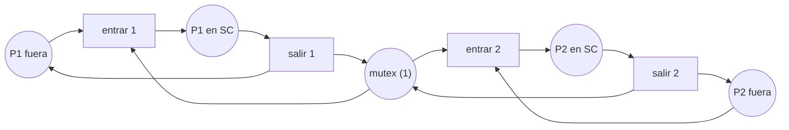

*El lugar mutex tiene 1 token. entrar 1 y entrar 2 compiten por ese único token → solo uno entra a la sección crítica a la vez. Al salir, el token vuelve. La marca mutex + (P1 en SC) + (P2 en SC) = 1 es el invariante que prueba la exclusión mutua.*

### Ejemplo 2 — Productor-Consumidor con buffer acotado

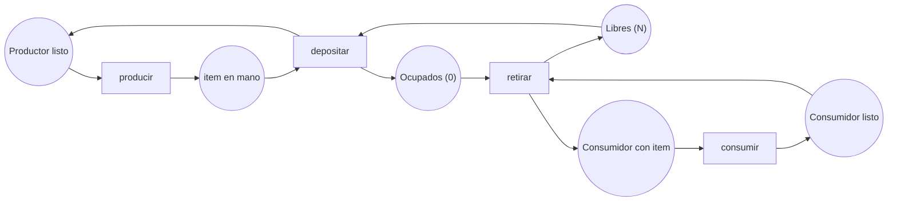

*Libres arranca con N tokens (huecos) y Ocupados con 0. Depositar requiere un hueco libre (consume de Libres, produce en Ocupados); retirar requiere un ítem (consume de Ocupados, produce en Libres). Invariante Libres + Ocupados = N: nunca se sobrepasa la capacidad. Son exactamente los semáforos notFull (Libres) y notEmpty (Ocupados).*

### Ejemplo 3 — Reserva de asientos de un estadio (final 16/07/2026)

**Enunciado:** 3 asientos disponibles; un cliente reserva un asiento si hay al menos uno libre (si no, espera); un asiento ocupado puede liberarse (cancelación) y queda disponible; nunca debe reservarse más asientos de los que existen.

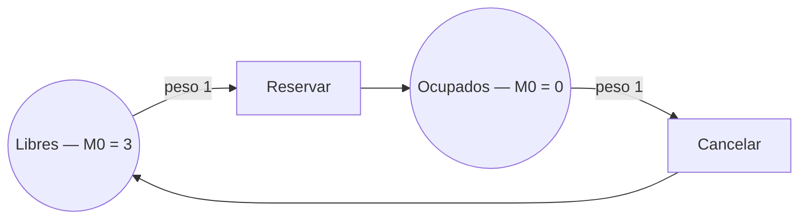

*Lugares: Libres (asientos disponibles) y Ocupados (asientos reservados). Transiciones: Reservar (habilitada solo si Libres ≥ 1: consume 1 de Libres y produce 1 en Ocupados) y Cancelar (consume 1 de Ocupados y produce 1 en Libres). Marca inicial M0 = (Libres:3, Ocupados:0).*

Por qué es correcto:

el

invariante

Libres + Ocupados = 3

se mantiene en todo disparo (Reservar y Cancelar solo mueven un token de un lugar al otro). Por lo tanto

Ocupados ≤ 3

siempre

→ nunca se reservan más de 3 asientos. Cuando

Libres = 0

,

Reservar

no está habilitada: el cliente

espera

(exactamente lo que pide el enunciado).

Secuencia de disparos válida:

M0=(3,0)

→ Reservar →

(2,1)

→ Reservar →

(1,2)

→ Reservar →

(0,3)

→

(otro cliente quiere reservar pero Reservar está deshabilitada: espera)

→ Cancelar →

(1,2)

→ Reservar →

(0,3)

.

### Modelado de otros problemas clásicos

- **Lector-Escritor:** un lugar «recurso» con capacidad; para *preferencia de escritura* se usan **arcos inhibidores** que impiden que entren lectores si hay un escritor esperando.
- **Cliente-Servidor:** lugares para peticiones/respuestas y transiciones para el procesamiento.

**En el final (Ej. típico de Petri):** (1) describir Red Ordinaria vs General y qué son `I(t)`/`O(t)`; (2) modelar un sistema. Receta para modelar: identificá los **lugares** (estados/recursos, con su marca inicial), las **transiciones** (acciones), dibujá los arcos, y **justificá con un invariante** por qué la propiedad de seguridad (ej. «no más de N») se cumple. Cerrá con una **secuencia de disparos válida**.

<a id="transacciones"></a>

## 13. Transacciones distribuidas y ACID

Un sistema de **transacciones** se compone de procesos independientes que pueden fallar aleatoriamente. Los errores de comunicación los maneja de forma transparente la capa de red, y se asume **almacenamiento estable** (discos con probabilidad muy baja de perder datos). Primitivas: `BEGIN`, `END` (intenta commit), `ABORT` (rollback a los valores previos), `READ`, `WRITE`.

### Propiedades ACID

| Propiedad | Significado |
| --- | --- |
| **A**tómica | Unidad indivisible: se completa *toda* o no se realiza en absoluto. |
| **C**onsistente | Cumple todos los invariantes del sistema. |
| **I**solated / Serializable | Las transacciones concurrentes no interfieren; su ejecución equivale a *alguna* ejecución serial. |
| **D**urable | Una vez confirmados (commit), los cambios son permanentes. Las transacciones anidadas son la excepción a la durabilidad. |

### Implementaciones

- **Private Workspace:** el proceso recibe una *copia* de los archivos, trabaja sobre ella y persiste al commit. Desventaja: muy costoso sin optimizaciones.
- **Writeahead Log:** se modifican los archivos *in place* pero antes se escribe en un *log* la lista de cambios (primero el log, luego el archivo). Al commitear se escribe un registro de commit; al abortar se lee el log **hacia atrás** para deshacer (rollback).

### Two-Phase Commit (2PC)

Protocolo de confirmación distribuida con un **coordinador**:

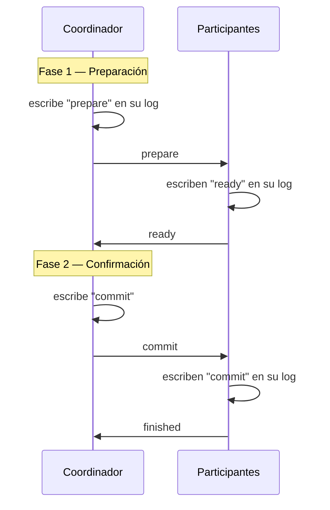

*Fase 1: el coordinador escribe «prepare» y lo envía; los participantes escriben «ready» y responden. Fase 2: el coordinador confirma («commit») y los participantes aplican y responden «finished». Todo pasa por el log para poder recuperarse ante caídas.*

Ventajas del 2PC:

garantiza atomicidad global (todos commitean o ninguno), es simple y recuperable gracias al log.

Desventajas:

es

bloqueante

— si el coordinador cae en la fase 2, los participantes quedan en «ready» esperando; el coordinador es cuello de botella y punto único de fallo; agrega latencia (2 rondas de mensajes).

### Control de concurrencia

| Técnica | Cómo funciona | Ventajas / desventajas |
| --- | --- | --- |
| **2PL** (Two-Phase Locking) | Fase de *expansión*: toma todos los locks necesarios. Fase de *contracción*: los libera y no puede tomar nuevos. **Strict 2PL**: la contracción ocurre después del commit. | Garantiza serializable. puede causar deadlocks |
| **Concurrencia optimista** | Modifica sin control esperando no tener conflictos; al commit verifica si otra transacción tocó los mismos archivos. Si hay conflicto, **aborta**. | Libre de deadlocks, favorece el paralelismo. Rehacer el trabajo es costoso *bajo alta contención*. |
| **Timestamps** | Cada transacción recibe un timestamp único global al iniciar (Lamport). Cada archivo guarda timestamps de lectura/escritura. Si el TS de la transacción es mayor que el del archivo, procede; si es menor (llegó «tarde»), aborta. Al commit actualiza los timestamps. | Sin deadlocks (ordena por tiempo). Puede abortar transacciones viejas que llegan tarde. |

Elegir según la carga (pregunta de final):

con

alta contención

(mucha escritura sobre los mismos datos, p. ej. venta de tickets en hora pico donde hay que evitar sobreventa),

optimista es mala idea

(aborta y rehace constantemente) → conviene

2PL/pessimista

o timestamps, que serializan el acceso. Con

baja contención

y mayoría de lecturas,

optimista

gana (sin overhead de locks, más paralelismo).

**En el final:** «explicar 2PC (ventajas/desventajas)» y «en qué casos usarías concurrencia optimista». Para el escenario de *compra de tickets / sobreventa*: describir 2PL, timestamps y optimista con pros y contras, y concluir que con la alta concurrencia de escritura de la hora pico conviene un esquema **pesimista (2PL / timestamps)** para prevenir compras duplicadas, dejando lo optimista para la parte de solo-lectura (mostrar disponibilidad).

<a id="deadlocks"></a>

## 14. Deadlocks distribuidos

Un **deadlock** es una situación en la que dos o más acciones se esperan mutuamente para terminar, y por eso ninguna avanza. En un sistema distribuido no hay un estado global observable de un vistazo, así que detectarlo y prevenirlo es más difícil.

### Detección

- **Algoritmo centralizado:** un coordinador mantiene el **grafo de uso de recursos**; los procesos le avisan al adquirir/liberar y él busca **ciclos**. Problema: mensajes *desordenados* pueden generar **falsos deadlocks**; se corrige con timestamps globales (Lamport).
- **Algoritmo distribuido (probe / Chandy-Misra-Haas):** cuando un proceso se bloquea esperando un recurso, envía un **probe message** (con IDs del proceso bloqueado, emisor y destinatario) al que tiene el recurso. Éste lo reenvía a los procesos que a su vez tienen lo que él necesita. Si el probe **vuelve al proceso original**, hay un ciclo → deadlock.

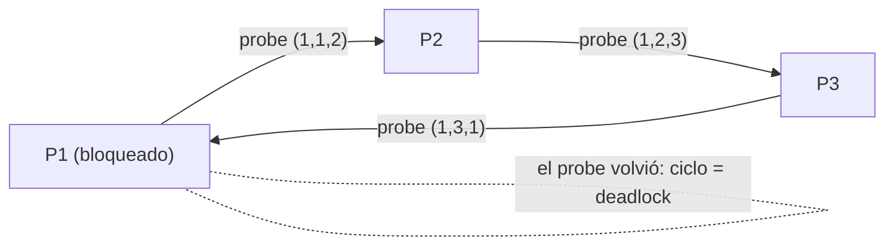

*Detección distribuida por probe: el mensaje sigue la cadena «espera-por»; si regresa a quien lo originó, existe un ciclo en el grafo global de espera.*

### Prevención (con timestamps globales)

Se asigna a cada transacción un timestamp único al iniciar. Cuando un proceso se bloquea por un recurso que otro tiene, se comparan los timestamps (más chico = más «viejo»):

| Algoritmo | El que pide es MÁS VIEJO | El que pide es MÁS JOVEN |
| --- | --- | --- |
| **Wait-Die** | Espera | Aborta (muere) y reintenta |
| **Wound-Wait** | Aborta (hiere) al que tiene el recurso, para tomarlo | Espera |

Ambos evitan la

espera circular

(condición de Coffman) porque solo se permite esperar en

una

dirección del orden temporal. La diferencia es a quién se aborta: en Wait-Die el joven se sacrifica; en Wound-Wait el viejo desaloja al joven.

**En el final:** «explicar el sistema de deadlocks distribuido con un gráfico». Contar detección (centralizada con grafo + falsos deadlocks por mensajes desordenados; distribuida con probe y ciclo) y prevención (wait-die vs wound-wait con timestamps). El gráfico esperado es el ciclo de espera / recorrido del probe.

<a id="exclusion"></a>

## 15. Exclusión mutua distribuida y elección de líder

### Exclusión mutua distribuida

Garantizar que **un solo proceso a la vez** entre a la sección crítica, sin memoria compartida, solo con mensajes.

| Algoritmo | Idea | Contras |
| --- | --- | --- |
| **Centralizado** | Un coordinador recibe `request`; si la SC está libre responde `OK`, si no encola y responde al liberarse. | Cuello de botella y **punto único de fallo**. |
| **Distribuido (Ricart-Agrawala)** | El que quiere entrar manda `(SC, id, timestamp)` a todos. Cada uno: si no está ni quiere → `OK`; si está en la SC → encola y da `OK` al salir; si también quiere → gana el **timestamp menor**. Entra cuando recibe `OK` de *todos*. | Muchos mensajes; N puntos de fallo. |
| **Token Ring** | Anillo lógico; un **token** circula; solo quien lo tiene entra a la SC. Al salir sigue circulando. | Latencia proporcional al tamaño del anillo; si se pierde el token hay que regenerarlo. |

### Elección de líder

Sirven para elegir un coordinador cuando un algoritmo lo requiere. Se asume que cada proceso tiene un **ID único**, corre uno por máquina y conoce el número de los demás. En ambos gana el de **mayor ID**.

- **Bully:** el proceso `P` que detecta la caída del coordinador manda `ELECTION` a todos los de **ID mayor**. Si nadie responde, `P` gana y anuncia `COORDINATOR`. Si responde alguien mayor (`OK`), `P` se retira y ese sigue la elección. Contras: en sistemas grandes genera muchos mensajes; un proceso de ID alto que falla puede reiniciar la elección repetidamente.
- **Ring:** el que nota la caída crea un mensaje `ELECTION` con su ID y lo pasa a su sucesor; cada uno **agrega su ID** y reenvía. Cuando el mensaje completa la vuelta, el de **mayor ID de la lista** es el nuevo coordinador (se anuncia con `COORDINATOR`). Contras: latencia lineal con el número de procesos; requiere el anillo operativo.

**En el final:** comparar los tres algoritmos de exclusión mutua (centralizado = simple pero SPOF; Ricart-Agrawala = sin coordinador pero N² mensajes; token ring = justo pero con latencia) y saber que Bully y Ring siempre eligen al de mayor ID.

<a id="sockets"></a>

## 16. Sockets y modelo cliente-servidor

Un **socket** es una interfaz que permite la comunicación entre dos procesos, en la misma máquina o en máquinas distintas. Es la base del **modelo cliente-servidor**: el **cliente** es el proceso *activo* que inicia la interacción; el **servidor** es el *pasivo* que espera y responde.

- **Arquitecturas:** de *dos niveles* (cliente ↔ servidor) o de *tres niveles* (con un **middleware** entre medio que aporta seguridad y balanceo de carga).
- **Tipos de servidor:** *iterativo* (atiende una petición a la vez) o *concurrente* (atiende varias simultáneamente, típicamente un thread/tarea por conexión).

### Tipos de sockets

| Tipo | Protocolo | Característica |
| --- | --- | --- |
| **Stream** | TCP | Entrega garantizada del flujo de bytes, con control de errores y de flujo. |
| **Datagram** | UDP | Sin conexión; la entrega *no* está garantizada. |
| **Raw** | IP | Permiten enviar paquetes IP directamente. |
| **Sequenced Packet** | SPP | Como stream pero preservan los delimitadores de registro. |

### Llamadas al sistema y flujo

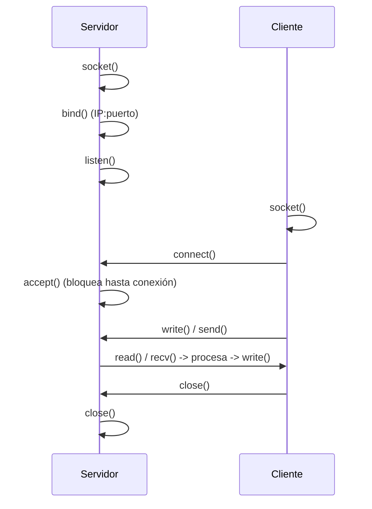

*El servidor hace socket → bind → listen → accept (accept bloquea hasta que llega una conexión); el cliente hace socket → connect. Luego intercambian datos con read/write (o send/recv para stream, sendto/recvfrom para datagram) y cierran con close.*

### Sockets en Rust (std::net)

```rust
use std::io::{Read, Write};
use std::net::{TcpListener, TcpStream};
use std::thread;

// Servidor concurrente: un thread por conexión
fn servidor() -> std::io::Result<()> {
    let listener = TcpListener::bind("127.0.0.1:8080")?;   // bind + listen
    for stream in listener.incoming() {                    // iterador de conexiones
        let mut stream = stream?;                          // = accept()
        thread::spawn(move || {
            let mut buf = [0u8; 512];
            let n = stream.read(&mut buf).unwrap();        // Read trait
            stream.write_all(&buf[..n]).unwrap();          // eco
            stream.flush().unwrap();
        });
    }
    Ok(())
}

// Cliente
fn cliente() -> std::io::Result<()> {
    let mut stream = TcpStream::connect("127.0.0.1:8080")?; // connect
    stream.write_all(b"hola")?;
    let mut resp = String::new();
    stream.read_to_string(&mut resp)?;
    Ok(()) // al salir de scope, drop(stream) inicia el cierre TCP
}
```

`TcpStream` implementa `Read` y `Write`; `flush()` fuerza el envío del buffer; la conexión se cierra al hacer **drop** del stream (o explícitamente con `shutdown()`, que puede cerrar el extremo de lectura, de escritura o ambos).

**En el final:** distinguir stream (TCP, confiable) vs datagram (UDP, no confiable), servidor iterativo vs concurrente, y el orden de syscalls del lado servidor (`bind → listen → accept`) vs cliente (`connect`).

<a id="ambientes"></a>

## 17. Ambientes distribuidos

Un **ambiente distribuido** es un sistema donde múltiples unidades de cómputo trabajan juntas, están **separadas espacialmente** y se comunican **a través de mensajes**. Es un modelo formal para razonar sobre algoritmos distribuidos.

### Entidad y sus capacidades

Una **entidad** es la unidad de cómputo (proceso, procesador, microcontrolador). Sus **capacidades**:

- Acceso de lectura/escritura a una **memoria local no compartida** con otras entidades, que incluye un registro de **estado** `status(x)` y uno de **valor de entrada** `value(x)`.
- **Procesamiento local** (CPU, ALU).
- **Interfaz de comunicación** para preparar, enviar y recibir mensajes.
- Setear y resetear un **reloj local**.

Una entidad es **reactiva**: solo responde a **eventos externos**, que son: la *llegada de un mensaje*, la *activación de un temporizador* local, o un *impulso espontáneo* (evento interno que la entidad se dispara a sí misma).

### Acción, Regla y Comportamiento

Acción:

secuencia

finita e indivisible

(atómica) de operaciones, ejecutada sin interrupciones.

Regla:

define qué acción ejecutar cuando una entidad en cierto

estado

detecta cierto

evento

, con la forma

estado × evento → acción

.

Comportamiento

B(x)

:

el conjunto total de reglas que la entidad

x

obedece. Para cada par (estado, evento) hay una

única regla

.

B(x)

es el

protocolo

o

algoritmo distribuido

de

x

.

El **comportamiento colectivo** del ambiente es el conjunto de comportamientos de todas las entidades. Es **homogéneo** si todas tienen el mismo comportamiento; *cualquier* protocolo puede transformarse en homogéneo.

### Comunicación, axiomas y restricciones

- Las entidades se comunican con **mensajes** (secuencias finitas de bits). Una entidad puede tener **vecindad restringida**: `NOUT(x)` = vecinos a los que puede enviar; `NIN(x)` = vecinos de los que puede recibir.
- **Axiomas de la red:** *delays finitos* (en ausencia de fallas, los retrasos son finitos) y *orientación local* (la entidad distingue sus vecinos `NIN`/`NOUT`, sabe quién le manda y a quién mandar).
- **Restricciones de confiabilidad:** *entrega garantizada* (todo mensaje llega intacto), *confiabilidad parcial* (no ocurrirán fallas), *confiabilidad total* (no han ocurrido ni ocurrirán).
- **Restricciones temporales:** *delays acotados* (constante Δ), *delays unitarios* (1 unidad de tiempo), *relojes sincronizados* (todos incrementan a la par).

### Estados, tiempo y conocimiento

- **Estado / configuración:** el estado interno `σ(x, t)` es el contenido de los registros de `x` más su reloj en el instante `t`. Cambia con los eventos. Es **determinístico**: mismo evento + mismo estado interno ⇒ mismo estado nuevo.
- **Tiempo y eventos:** al ocurrir un evento externo se dispara una acción indivisible que puede generar eventos futuros (`Future(t)`), creando nuevas secuencias de ejecución según los delays.
- **Costo y complejidad:** métricas para comparar algoritmos: cantidad de mensajes/transmisiones (`M`) y **tiempo** (total e ideal, bajo delays unitarios y relojes sincronizados).

Conocimiento:

el

conocimiento local

es el contenido de la memoria local de

x

y lo que se deriva de ella; en ausencia de fallas no se puede perder. Tipos:

información métrica

(datos numéricos: nº de nodos, aristas, diámetro),

propiedades topológicas

(p. ej. «el grafo es un anillo/árbol») y

mapas topológicos

(mapa de la vecindad hasta distancia

d

, p. ej. la matriz de adyacencia).

**En el final (aparece seguido):** «qué es una entidad y enumerar sus capacidades»; «explicar Acción, Regla y Comportamiento y cómo se caracteriza» (respuesta: por su conjunto de reglas `estado × evento → acción`, que es su protocolo, con una única regla por par estado-evento, y puede ser homogéneo); «qué es el Conocimiento y qué tipos existen» (métrico, topológico, mapas).

<a id="redes"></a>

## 18. Redes y modelo OSI (repaso)

Para entender la comunicación distribuida conviene repasar el **modelo de capas**: una separación en niveles (física, enlace, red, transporte, sesión, presentación, aplicación) que abstrae las funciones de comunicación y favorece la **modularidad** y la **portabilidad**.

- Cada capa `N` ofrece un **servicio** a la capa `N+1` y se comunica con su par mediante un **protocolo** de capa `N`.
- **Tipos de servicio:** *sin conexión* (UDP puro, sin control de flujo ni errores), *sin conexión con ACK* (acuse por cada dato, más confiable sin enlace dedicado) y *con conexión* (TCP: tres fases —establecimiento, datos, cierre— con control de flujo y de errores).
- **OSI:** estándar de 7 capas que define interfaces y protocolos en cada nivel. **TCP/IP** es la pila real (IP, TCP, UDP y protocolos de aplicación como HTTP, FTP).

**En el final:** suele venir como apoyo de sockets. Recordar: TCP = con conexión, confiable, control de flujo/errores; UDP = sin conexión, sin garantías; y que cada capa da un *servicio* a la de arriba y habla un *protocolo* con su par.

<a id="finales"></a>

## A. Finales resueltos y cómo resolverlos

El final es **conceptual + modelado + diseño**: definir y comparar conceptos, modelar con Redes de Petri o actores, y diseñar un sistema justificando decisiones. Rara vez pide implementar de cero; casi siempre pide *explicar, comparar y justificar*.

Método para cualquier consigna:

(1)

Definí

el concepto con precisión. (2)

Contrastá

con lo vecino (semáforo vs monitor, 2PL vs optimista, deadlock vs starvation). (3)

Ejemplificá

o

modelá

(diagrama). (4)

Justificá

la elección para el caso concreto (¿CPU o I/O?, ¿alta o baja contención?, ¿qué invariante garantiza la seguridad?).

### Final 16/07/2026 — resuelto

1. **Redes de Petri:** Red Ordinaria vs General, `I(t)`/`O(t)`, y modelar la reserva de 3 asientos. → Resuelto completo en [§12 Redes de Petri](#petri) (lugares `Libres`/`Ocupados`, invariante `Libres+Ocupados=3`, secuencia de disparos).
2. **Monitores:** implementación, métodos y comparación con semáforos. → [§10](#semaforos): variables de condición (FIFO, sin valor), `waitC` siempre bloquea y libera el monitor, `signalC` no hace nada si la cola está vacía; tabla semáforo vs monitor.
3. **Transacciones:** 2PC (ventajas/desventajas) y cuándo usar concurrencia optimista. → [§13](#transacciones): 2PC atómico pero bloqueante y con SPOF; optimista conviene con *baja contención* y mayoría de lecturas.
4. **Ambientes distribuidos:** Acción/Regla/Comportamiento y Conocimiento. → [§17](#ambientes).
5. **Diseño de un sistema (venta online):** resuelto abajo.

### Final 09/07/2026 — resuelto

1. **Comparar** busy-wait, deadlock, race condition y starvation. → [§8](#correccion) (tabla de los cuatro).
2. **Modelo de actores:** motivación, características y ciclo de vida en Actix. → [§7](#mensajes).
3. **Deadlocks distribuidos** + gráfico. → [§14](#deadlocks) (detección centralizada/probe, prevención wait-die/wound-wait).
4. **Entidad** en un ambiente distribuido y sus capacidades. → [§17](#ambientes).
5. **Compra-venta de tickets en hora pico** (prevenir compras duplicadas, mucha lectura y escritura): explicar 2PL, timestamps y optimista y elegir. → [§13](#transacciones): con alta contención de escritura conviene **pesimista (2PL / timestamps)** para evitar la sobreventa; optimista solo para la parte de lectura.

### Diseño de un sistema — Venta online con reserva de stock

**Problema:** tienda que despacha de un único depósito; los usuarios eligen producto/variante/cantidad, el sistema reserva temporalmente el stock, valida la cobertura de envío, cobra y emite la orden, **evitando vender más unidades de las que hay** incluso con muchos usuarios en simultáneo.

#### 1) Esquema de transaccionalidad

El punto crítico es el **decremento de stock**: debe ser una **sección crítica serializada por SKU**. Un **actor por producto** (o un `Mutex`/lock pesimista por SKU) procesa las reservas *de a una* → imposible que dos usuarios reserven la última unidad (misma garantía que el invariante de los asientos en Petri). El checkout es una **transacción** con reserva de TTL: `Reservar → ValidarEnvío → Cobrar → Confirmar`, y si algún paso falla se hace **rollback** liberando la reserva.

| Problema potencial | Cómo lo resuelve |
| --- | --- |
| Sobreventa de la misma unidad | Reserva serializada por SKU (actor/lock); solo se confirma si la reserva fue exitosa. |
| Cobertura de envío fallida | Se valida *antes* de cobrar; si falla, se libera la reserva. |
| Pago rechazado | Rollback de la transacción: se libera el stock reservado (writeahead log / compensación). |
| Usuario que abandona el checkout | La reserva tiene **TTL**: expira y el stock vuelve a estar disponible. |

#### 2) Entidades y mensajes

| Entidad | Estado interno | Mensajes |
| --- | --- | --- |
| Sesión/Checkout | carrito, dirección, estado del flujo | envía `Reservar`, `ValidarEnvío`, `Cobrar`, `Confirmar`/`Cancelar` |
| Producto (actor por SKU) | `stock`, reservas con TTL | recibe `Reservar(qty)`→`Ok/Sin stock`, `Confirmar`, `Liberar` |
| ServicioEnvío | coberturas por código postal | recibe `ValidarEnvío(cp)` |
| Pasarela de pago | — | recibe `Cobrar(datos)`→`Aprobado/Rechazado` |
| Orden | ítems, estado, pago | se crea con `Confirmar` y emite el despacho |

#### 3) Casos de éxito y de falla

- éxito Reserva OK → envío cubierto → pago aprobado → **Confirmar**: se descuenta el stock definitivamente y se emite la orden.
- éxito Retiro en sucursal: igual pero sin validación de envío a domicilio.
- falla Stock agotado por otro usuario durante el checkout: `Reservar` devuelve «Sin stock» → se avisa y no se cobra.
- falla Pago rechazado: se envía `Liberar` al Producto y se cancela la transacción; el stock reservado vuelve.

#### 4) Diagrama de secuencia de una ejecución posible

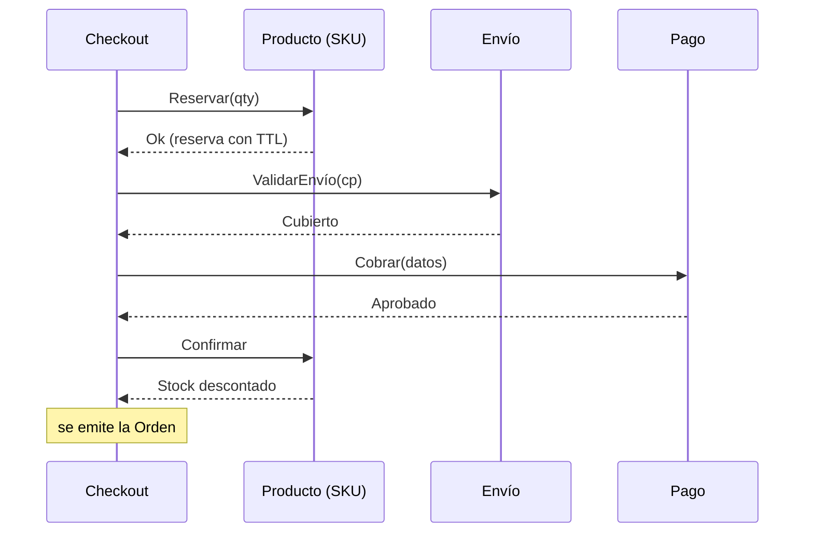

*Camino feliz. Si Cobrar devuelve «Rechazado», Checkout envía Liberar al Producto y aborta.*

#### 5) Pseudocódigo Rust (actor Producto)

```rust
use actix::prelude::*;

#[derive(Message)]
#[rtype(result = "Result<(), &'static str>")]
struct Reservar { qty: u32 }

struct Producto { stock: u32, reservado: u32 }

impl Actor for Producto { type Context = Context<Self>; }

impl Handler<Reservar> for Producto {
    type Result = Result<(), &'static str>;
    fn handle(&mut self, msg: Reservar, _: &mut Context<Self>) -> Self::Result {
        // Un mensaje a la vez => decremento serializado, sin sobreventa
        if self.stock - self.reservado >= msg.qty {
            self.reservado += msg.qty;        // reserva temporal (con TTL aparte)
            Ok(())
        } else {
            Err("sin stock")                  // el checkout avisa al usuario
        }
    }
}
// Confirmar: stock -= qty; reservado -= qty.   Liberar: reservado -= qty.
```

Este diseño combina tres temas del programa:

actores

(§7, aislamiento sin locks),

transaccionalidad

(§13, reserva + rollback) y el

invariante de capacidad

de las

Redes de Petri

(§12,

reservado ≤ stock

). Mostrar esa integración es lo que distingue un buen final.

<a id="ejercicios"></a>

## B. Banco de ejercicios (parciales)

Ejercicios reales de parcial con su resolución. Intentá resolverlos *antes* de abrir la solución.

**1. ¿Es busy-wait? Analizar fragmentos de código**

**Regla:** es busy-wait solo si el loop *gira consumiendo CPU sin ceder ni hacer trabajo útil*.

- Minero que en cada vuelta *mina*, escribe un resultado y hace `thread::sleep` → **NO** es busy-wait (hace trabajo útil y cede CPU).
- Loop que toma un `write lock`, si acumuló ≥100 produce una batería, y duerme 500 ms → **NO** (duerme entre chequeos y produce cuando corresponde).
- `loop { match TcpStream::connect(...) { Ok → usar; Err → sleep } }` → **NO** (reintenta con espera).
- Loop que revisa vencimientos en una lista y hace `sleep` aleatorio entre pasadas → **NO**.
- `loop { if *flag.lock() { break } }` sin sleep → **SÍ**, busy-wait (spin apretado).

Ver la regla completa en [§8](#correccion).

**2. Identificar la estructura y sus errores (Mutex + Condvar)**

Un `struct { mutex: Mutex&lt;i32&gt;, cond_var: Condvar }` con `function_1` (si `amount &lt;= 0` hace `wait`, luego `-= 1`) y `function_2` (`+= 1` y `notify_all`) es un **semáforo contador** (implementado como monitor).

**Error:** usa `if *amount &lt;= 0 { wait }` en vez de `while`. Ante un **spurious wakeup** o varios waiters despertados por `notify_all`, un proceso puede seguir con `amount == 0` y decrementar a negativo. **Solución:** cambiar el `if` por `while`. (Ver [§10](#semaforos).)

**3. Programación asincrónica — Verdadero/Falso**

- «El que hace poll es el thread principal» → **F** (lo hace el executor/runtime).
- «poll se llama solo cuando la tarea puede progresar» → **V**.
- «El modelo piñata es colaborativo» → **V** (cooperativo).
- «La operación async inicia al llamar a la función `async`» → **F** (solo se crea el Future; arranca al primer poll/await).
- «Procesos, hilos y tareas async tienen memoria independiente» → **F** (hilos y tareas comparten la del proceso).
- «El scheduler del SO puede pausar una tarea async puntual» → **F** (las async son cooperativas, las maneja el executor).
- «Threads y tareas async tienen stack propio» → **parcial**: el thread sí; la tarea async guarda su estado en el Future, no en un stack del SO dedicado.
- «Con una sola CPU, hilos CPU-intensivos tardan mucho menos que tareas async con el mismo cómputo» → **F**: con cómputo puro no hay ventaja async; incluso los hilos pagan cambios de contexto.

**4. Elegir el modelo de concurrencia por caso**

Resuelto en la tabla de [§4](#modelos): matrices→SIMD/GPU; varias APIs→async; log muy visitado→async o RwLock; backend de juego→actores; muchos .DOC→.PDF→fork-join; Menti/Kahoot→actores; caché→RwLock; API con modelo NLP→async + `spawn_blocking`.

**5. Pseudocódigo: descargar 100 links con máximo N threads y medir el promedio**

```rust
use std::sync::{Arc, Mutex};
use std::time::{Duration, Instant};

let links: Vec<String> = /* 100 URLs */ vec![];
let n = 8;                                   // máximo de threads activos
let sem = Arc::new(Semaphore::new(n));       // limita la concurrencia
let total = Arc::new(Mutex::new(Duration::ZERO));
let mut handles = vec![];

for url in links {
    let sem = Arc::clone(&sem);
    let total = Arc::clone(&total);
    handles.push(std::thread::spawn(move || {
        let _permit = sem.access();          // no más de N a la vez (RAII)
        let t0 = Instant::now();
        // simular espera de red
        std::thread::sleep(Duration::from_millis(rand_ms()));
        let elapsed = t0.elapsed();
        *total.lock().unwrap() += elapsed;
    }));
}
for h in handles { h.join().unwrap(); }
let promedio = *total.lock().unwrap() / 100; // tiempo promedio
```

El **semáforo** acota los threads activos (baja latencia); el `Arc&lt;Mutex&gt;` acumula los tiempos. Como es I/O simulada, una variante idiomática sería **async** con un límite de concurrencia.

**6. Modelar en Petri: productor-consumidor y lector-escritor**

Productor-consumidor con buffer acotado: resuelto en [§12](#petri) (lugares `Libres`/`Ocupados`). Lector-escritor sin preferencia: un lugar «recurso»; con preferencia de escritura se agregan **arcos inhibidores** que frenan a los lectores si hay un escritor esperando (ver [§11](#clasicos) y [§12](#petri)).

**7. Diseñar con actores: el restaurante de San Telmo**

Cliente, Mozo, Cocinero y Depósito (acceso exclusivo de a uno). Estados y mensajes en la tabla de [§7](#mensajes). El Depósito serializa el acceso de a uno (como un mutex/actor); los cocineros notifican `PlatoListo` a los mozos.

<a id="glosario"></a>

## C. Glosario

| Término | Definición breve |
| --- | --- |
| Instrucción atómica | Se ejecuta entera o no se ejecuta; sin interrupciones. |
| Interleaving | Intercalación arbitraria de las instrucciones atómicas de los procesos (respetando el orden causal de cada uno). |
| Concurrencia / Paralelismo | Tratar varias tareas a la vez (diseño) / ejecutarlas físicamente en simultáneo (hardware). |
| Race condition | El resultado depende del timing de accesos no sincronizados a estado compartido. |
| Busy-wait | Espera activa: girar en un loop consumiendo CPU sin trabajo útil. |
| Deadlock | Procesos que se esperan mutuamente; nadie avanza (condiciones de Coffman). |
| Starvation | Un proceso listo nunca obtiene el recurso; el sistema sí avanza. |
| Safety / Liveness | «Algo malo nunca pasa» (siempre) / «algo bueno eventualmente pasa». |
| Sección crítica | Bloque que accede a recursos compartidos; requiere exclusión mutua. |
| Semáforo | Contador (V, L) con `wait`/`signal` atómicos; binario = mutex. |
| Monitor | Exclusión mutua + variables de condición (`waitC`/`signalC`, FIFO). |
| Spurious wakeup | Despertar sin `notify`; por eso el wait va en un `while`. |
| Ownership / Send / Sync | Un dueño por valor; `Send` = mover entre threads; `Sync` = referenciar desde varios threads. |
| Arc / Mutex / RwLock | Compartir dueño entre threads / lock exclusivo / lock lectura-escritura. |
| Future / poll | Operación async testeable; `poll` nunca bloquea (Ready/Pending); modelo piñata. |
| Fork-Join / Work stealing | Dividir en subtareas y unir; balanceo robando tareas de otras deques. |
| Actor | Entidad aislada con estado privado; se comunica solo por mensajes; mailbox FIFO. |
| Red de Petri | (T, P, A[, W, M0]); lugares con tokens, transiciones que disparan. |
| ACID | Atomic, Consistent, Isolated/Serializable, Durable. |
| 2PC | Two-Phase Commit: prepare/ready + commit/finished, con coordinador. |
| 2PL | Two-Phase Locking: expansión (toma) + contracción (libera); serializable. |
| Concurrencia optimista | Sin locks; verifica conflictos al commit y aborta si los hay. |
| Wait-Die / Wound-Wait | Prevención de deadlock con timestamps (el viejo espera / el viejo desaloja). |
| Ricart-Agrawala / Token Ring | Exclusión mutua distribuida por timestamps / por token en anillo. |
| Bully / Ring | Elección de líder; siempre gana el de mayor ID. |
| Entidad (ambiente distribuido) | Unidad de cómputo reactiva con memoria local, comportamiento = reglas estado×evento→acción. |
